---
sidebar:
  nav: "docs"
title : 포트포워딩
---

VMWare (Ubuntu) 네트워크 포트포워딩 설정

---


**<i class="fa fa-info-circle" aria-hidden="true"></i> 정보**
Ctrl + Alt + F1 ~ F6 : CLI <=> GUI 변경
{: .notice--info}

---

**네트워크 설정 확인**

```s
sudo apt update
```

```s
sudo apt install net-tools
```

```s
ifconfig
```

```s
IPv4 : *.*.*.*
Subnet Mask : *.*.*.*
브로드 캐스트 : *.*.*.255
네트워크 어댑터 인터페이스 : ens33
```

이곳에서 `네트워크 어댑터 인터페이스` 명을 기억합시다.

**<i class="fa fa-info-circle" aria-hidden="true"></i> 정보**
Windows cmd 에서는 ipconfig로 확인
{: .notice--info}

`VMWare`에서 `VMnet8` 설정을 확인   
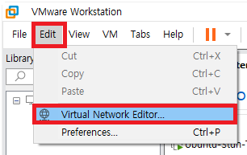


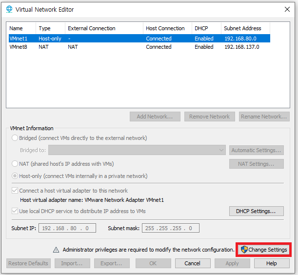
 
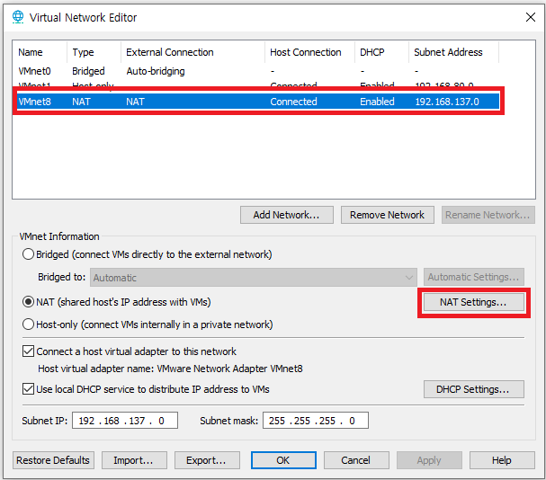

게이트웨이 주소 : `192.168.137.2` 확인    


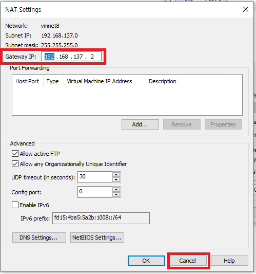   

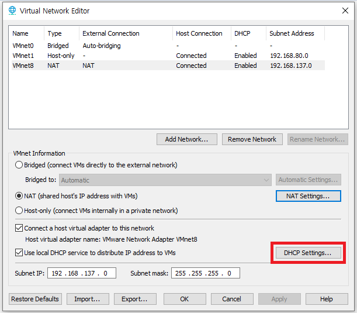   

`192.168.137.128` ~ `192.168.137.254` 범위 중에 내가 고정하고 싶은 IP 1개를 선택해서 설정하자.   
저는 `192.168.168.128`로 설정하겠습니다.   
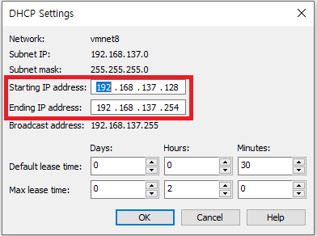

---

**고정IP 설정**

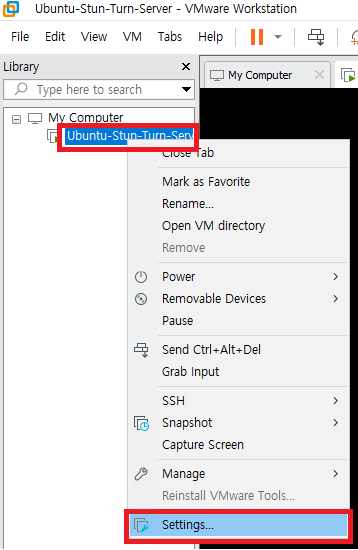

위에서 확인한 `VMnet8(NAT)`로 설정
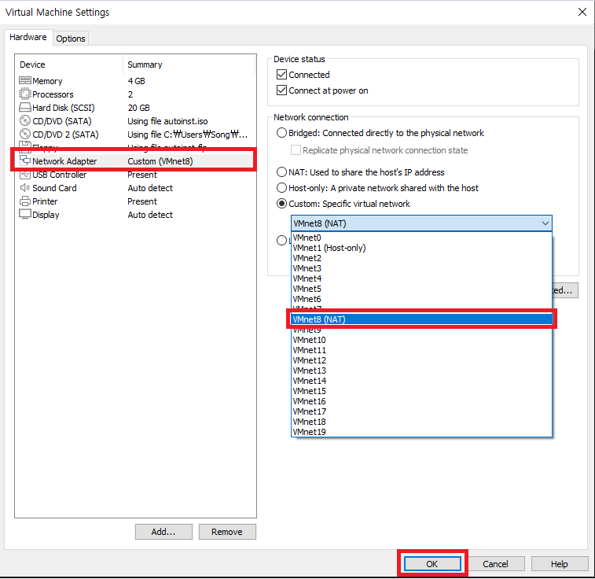


Ubuntu 네트워크 설정 파일 수정
```s
/etc/netplan
```

```s
nano 01-network-manager-all.yaml
```

```s
network:
  version: 2
  renderer: NetworkManager
  ethernets:
    ens33: --네트워크 어댑터 인터페이스 명
      dhcp4: no
      addresses:
       - 192.168.137.128/24  --고정할 IP 및 서브마스크
      routes:
       - to: default
         via: 192.168.137.2  --게이트웨이
      nameservers:
        addresses: [192.168.137.2]  --게이트웨이를 적자
```

네트워크 설정 반영
```s
sudo netplan apply
```

ip 변경 됐는지 확인
```s
ifconfig
```

---

**PUTTY (안해도 됨)**   

```s
sudo apt-get install ssh
```

```s
sudo apt-get install openssh-server
```

ssh 재시작
```s
sudo /etc/init.d/ssh restart
```

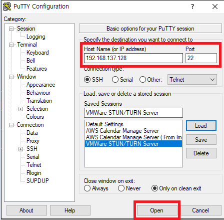

---

**Windows 와 VMWare 포트포워딩**

`9090` 포트 포워딩
 


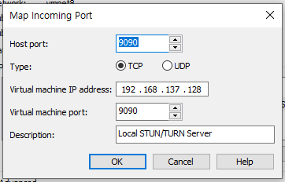

---

**공유기 포트포워딩**

`9090` 포트 포워딩

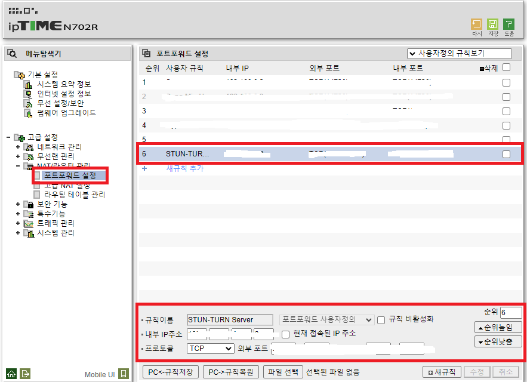

---

**방화벽 설정**


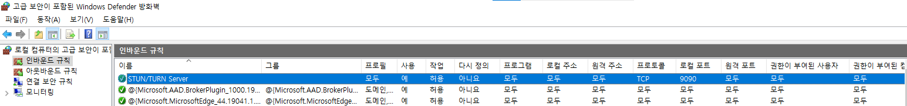


---

이제 ubuntu server에 node js server 를 9090으로 open 후에

외부 ip로 접근이 가능한지 확인해 보자

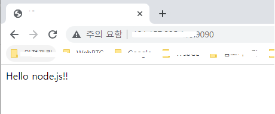

잘 된다 😊 헤헤


