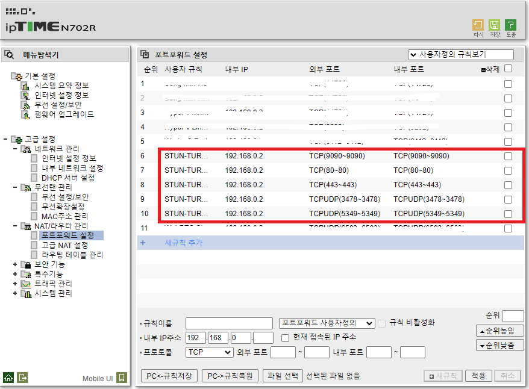
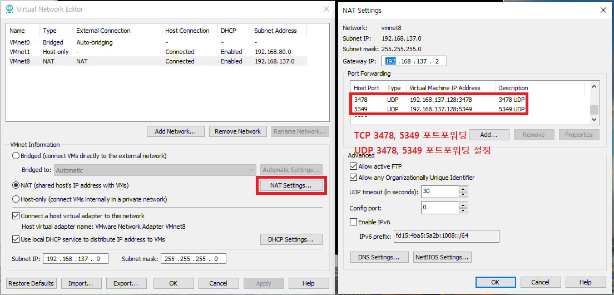
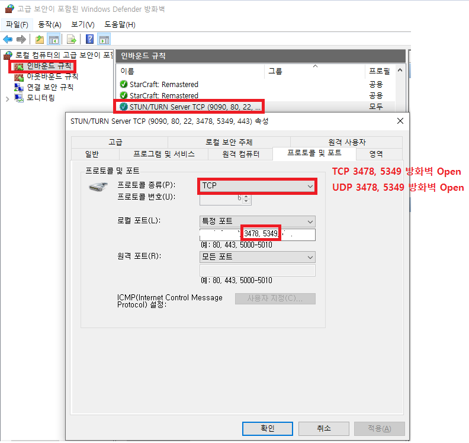
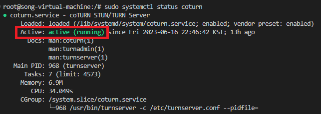
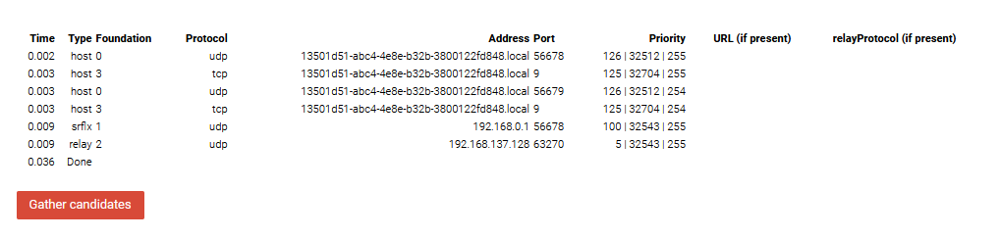
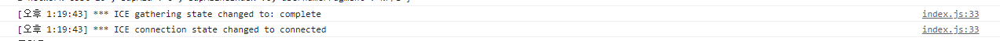

---
sidebar:
  nav: "docs"
title : STUN-TURN 서버 만들기
---

COTURN 을 이용하여 STUN/TURN 서버 만들기

---

# coturn 깃허브 사이트

[https://github.com/coturn/coturn](https://github.com/coturn/coturn)

---

# 개인적인 환경 구성   

AWS에 해도 되지만 개인적인 호기심에 VMWare에 Ubuntu를 설치하고,       
공유기 포트포워딩 + VMware 포트포워딩 + 방화벽 특정 포트 해제    
이렇게 네트워크 구성을 하고
coturn 오픈 소스를 이용해서 로컬환경에서 turn-stun 서버 구성해 봤습니다.    

https, domain 적용을 하긴 했지만, 하지 않아도 될 것 같아요    
테스트는 안해 봤습니다 😆 (될지 안될지는 잘 모릅니다... ㅎ)    

---

# coturn 이란   

[https://github.com/coturn/coturn](https://github.com/coturn/coturn)

TURN 및 STUN 서버의 무료 오픈 소스 구현입니다.   
TURN 서버는 VoIP 미디어 트래픽 NAT 통과 서버 및 게이트웨이입니다. 

**<i class="fa fa-info-circle" aria-hidden="true"></i> 정보**   
`   
**VoIP(Voice over Internet Protocol)**   
인터넷을 통해 음성 통화를 전송하는 기술을 의미합니다.    
VoIP 미디어 트래픽은 VoIP 통화 시 발생하는 음성 및 관련 데이터의 전송을 의미합니다.    
`   
{: .notice--info}

---

# coturn 설치   

```s
sudo apt-get -y update
sudo apt-get -y install coturn
```

---

# coturn 환경 설정   
```s
# UDP와 TCP에 대한 TURN listener 포트 (기본: 3478)
listening-port=3478
# TLS에 대한 TURN listener 포트 (기본: 5349).
tls-listening-port=5349
# VMWare IP : VMWare 내부 IP
listening-ip=[VMWare IP]
# 외부 IP : 공유기 외부 IP
# 내부 IP : 컴퓨터 내부 IP
external-ip=[외부 IP]/[내부 IP]
# UDP 릴레이 엔드포인트 포트 범위
min-port=49152
max-port=65535

verbose
fingerprint
# long-term credential 메커니즘 이용
lt-cred-mech
user=[사용자]:[비밀번호]
realm=[도메인]
syslog
```

---

# 포트포워딩 설정   

UDP, TCP만 사용하려면 `3478` 포트만 열면 됩니다.   
저도 UDP, TCP만 사용할 것이기 때문에 `3478`만 열어도 되는데... 혹시나 싶어서 그냥 `5349`도 열어 놓았습니다.   

**공유기 포트포워딩**   


**VMWare 포트포워딩**   


**방화벽 Port Open**


---

# Coturn 시작   

```s
# 시작
sudo systemctl start coturn
# 재시작
sudo systemctl restart coturn
```

```s
# 상태확인
sudo systemctl status coturn 
```



---

# ICE Server 테스트   

+ **크롬에서 테스트**

> 
`   
Done이 떴지만,  701 에러가 발견 됐습니다.


+ **파이어폭스에서 테스트**

>  
`   
파이어폭스에서는 에러가 발견 되지 않습니다.   


실제로 크롬에서 WebRTC P2P 연결을 시도해보니 `ICE Connected`가 완료가 된거 보면 괜찮은 것 같습니다. 😊   



개꿀찡~😊


---


