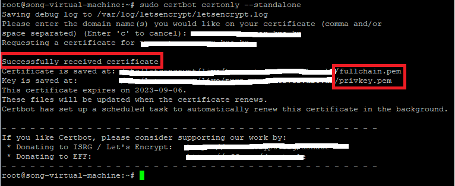
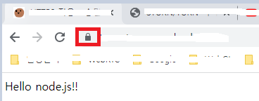

---
sidebar:
  nav: "docs"
title : HTTPS 적용
---

Ubuntu Server에 HTTPS 적용 시키기

---

**LetsEncrypt**

Let’s Encrypt는 공공의 이익을 위해 실행되는 무료, 자동화된 개방형 CA입니다.   
ISRG(Internet Security Research Group)에서 제공하는 서비스입니다.

[LetsEncrypt 홈페이지](https://letsencrypt.org/ko/about/)를 참고하세요.


**<i class="fa fa-info-circle" aria-hidden="true"></i> 정보**   
`   
**CA(Certificate Authority)**   
인증 기관 이라는 뜻.   
인증 기관으로서 동작하는 공개 인증서 서비스.   
무료로 SSL/TLS 인증서를 발급하고 관리하여 웹사이트와 사용자 간의 통신을 암호화하고 보안을 강화합니다.    
`   
**ISRG(Internet Security Research Group)**   
인터넷 보안을 개선하기 위해 설립된 비영리 단체   
`   
**SSL/TLS**   
SSL(Secure Sockets Layer)와 TLS(Transport Layer Security)는 인터넷 통신에서 보안을 제공하는 프로토콜입니다.   
이 프로토콜들은 클라이언트와 서버 간의 통신을 암호화하고, 데이터의 무결성을 보호하며, 상호 인증을 제공하여 제3자가 중간에서 데이터를 도청하거나 조작하는 것을 방지합니다.   
`   
TLS는 SSL의 후속 버전입니다.
SSL은 1990년대에 개발 되었고, TLS는 1999년에 SSL 3.0을 기반으로 개발되었습니다.   
`   
SSL/TLS 프로토콜은 공개키 암호화 방식을 사용하여 통신을 보호합니다.   
클라이언트는 서버에게 자신의 공개키를 보내고, 서버는 이를 사용하여 클라이언트와의 통신에 사용할 공유 비밀키를 암호화하여 전송합니다.   
이후에는 클라이언트와 서버 간의 모든 데이터가 암호화 되어 전송되므로, 제3자가 해당 데이터를 엿들을 수 없습니다.   
`   
일반적으로 웹 사이트에서는 HTTPS(HTTP Secure)를 통해 SSL/TLS를 사용합니다.   
HTTPS는 HTTP 프로토콜을 보안하기 위해 SSL/TLS를 사용하는 것을 의미합니다.   
{: .notice--info}   

웹 사이트에서 HTTPS를 사용하려면, CA(인증 기관)에서 인증서(파일 유형)를 가져와야 합니다.

웹 사이트 도메인에 대한 인증서를 받으려면 `ACME 프로토콜`을 사용하는 소프트웨어를 사용해야 합니다.   

그래서 해당 소프트웨어로 Certbot ACME 클라이언트를 사용하는 것이 좋습니다.   

**<i class="fa fa-info-circle" aria-hidden="true"></i> 정보**   
`   
**ACME(Automatic Certificate Management Environment)**   
자동 인증서 관리 환경   
인터넷 보안 프로토콜 중 하나입니다.   
인증서 발급, 갱신 및 폐기를 자동화하기 위한 강력한 도구와 프로세스를 제공합니다.    
`   
주로 공인 인증 기관(Certificate Authority, CA)와 클라이언트 사이의 상호 작용을 관리합니다.   
일반적으로 웹 사이트에서 HTTPS를 사용하려면 CA에서 발급한 유효한 인증서가 필요합니다.  
이러한 인증서는 웹 사이트와 사용자 간에 암호화된 통신을 보장하고, 중간자 공격과 같은 보안 위협으로부터 보호합니다.   
`   
CA와 클라이언트 간의 자동화된 프로세스를 정의하여 인증서 발급과 갱신을 간편하게 만듭니다.   
클라이언트는 ACME 프로토콜을 사용하여 CA와 통신하고, CA는 클라이언트의 요청에 따라 인증서를 발급하거나 갱신합니다.   
`   
ACME 프로토콜은 Let's Encrypt(오픈 소스 인증 기관)을 통해 널리 알려져 있으며, 무료로 인증서를 발급하고 갱신할 수 있는 기능을 제공합니다.   
`   
이를 통해 개인 및 기업은 웹 사이트를 보호하기 위해 보안 인증서를 쉽게 얻을 수 있습니다.   
`   
**SSH(Secure Shell)**  
`   
SSH (Secure Shell) 액세스는 원격 시스템에 안전하게 접근할 수 있는 프로토콜입니다.   
쉘은 운영 체제에서 제공하는 명령어 해석기로, 사용자가 컴퓨터와 상호 작용하기 위해 명령어를 입력하고 실행할 수 있는 환경을 제공합니다.   
`   
SSH 액세스를 사용하면 인터넷을 통해 원격 시스템에 접속하여 해당 시스템의 쉘을 이용할 수 있습니다.    
이를 통해 원격 시스템에 명령을 전송하고 결과를 받아올 수 있으며, 파일 전송 등 다양한 작업을 수행할 수 있습니다.   
`   
SSH는 네트워크 연결을 암호화하고 보안을 제공하기 때문에 중요한 정보를 전송하거나 원격 시스템에 접근해야 할 때 일반적으로 사용됩니다.    
SSH 액세스를 설정하려면 원격 시스템에 SSH 서버를 설치하고 구성해야 합니다. 
일반적으로 SSH 클라이언트 프로그램(예: OpenSSH)을 사용하여 원격 시스템에 연결하고 인증 과정을 거친 후에 쉘 접근을 할 수 있습니다.    
`   
SSH 액세스를 사용하면 원격 시스템을 안전하게 관리하고 제어할 수 있으며, 원격으로 작업할 때 편리하고 보안성이 높은 방법입니다.    
{: .notice--info}

---

**도메인 주소 발급 받기**  

[Freenom 홈페이지](https://www.freenom.com/en/index.html?lang=en)    

근데 도메인 등록 오류 때문에 잠시 중지 중이라고 한다..😒😒😒

한국에서 무료 도메인 서비스가 있나 싶어서 찾아봤는데... 존재하긴 한다...

[내도메인 한국](https://xn--220b31d95hq8o.xn--3e0b707e/)   
어떤 회사인지는 잘 모르겠으니... 선택은 자유... 

---

**Certbot**   

Certbot은 수동으로 관리되는 웹 사이트에서 인증서를 암호화하여 
HTTPS를 활성화하기 위한 무료 오픈 소스 소프트웨어 도구입니다.   

[Certbot 홈페이지](https://certbot.eff.org/)를 참고하세요.

```s
sudo snap install --classic certbot
```   

심볼릭 링크 생성
```s
sudo ln -s /snap/bin/certbot /usr/bin/certbot
```

만약 웹서버가 동작 되고 있지 않다면   
```s
sudo certbot certonly --standalone
```

웹서버 동작 중이고, 중지시키면 안된다면
```s
sudo certbot certonly --webroot
```

VMWare의 80포트로 포트포워딩 안돼서 실패 했었다. 😂   
공유기 포트포워딩, 방화벽 오픈, VMWare 포트포워딩을 해주자. (80포트)   
포트포워딩 하는 방법은 따로 정리해 두었으니 참고바람.😊      



이제 node server를 https로 시작하면 접속이 잘 된다.   

```javascript
var https = require('https'); 
const fs = require('fs');
const path = require('path');

var get_SSL_options = function () {
    return {
        key: fs.readFileSync(path.resolve("[경로]/privkey.pem")),
        cert: fs.readFileSync(path.resolve("[경로]/fullchain.pem"))
    }
}

var server = https.createServer(get_SSL_options(), function(request,response){ 

    response.writeHead(200,{'Content-Type':'text/html'});
    response.end('Hello node.js!!');

});

server.listen(9090, function(){ 
    console.log('Server is running...');
});
```



굳 👍
 


**<i class="fa fa-info-circle" aria-hidden="true"></i> 정보**   
`   
**snapd**   
snapd는 Ubuntu의 기본 패키지 관리 도구인 APT(Advanced Packaging Tool)와는 별개로 동작하며,   
별도의 커맨드 라인 도구인 snap을 사용하여 패키지를 관리합니다.    
또한, 스냅 패키지는 리눅스 배포판 간에 이식성이 높기 때문에 Ubuntu 이외의 다른 배포판에서도 사용할 수 있습니다.   
`   
**심볼릭 생성**   
`sudo ln -s [원본 파일/디렉토리 경로] [링크 파일/디렉토리 경로]`   
이 명령어는 파일이나 디렉토리에 대한 심볼릭 링크(symbolic link)를 생성하는 데 사용됩니다.    
`   
예를 들어, `/home/user1/original_file`이라는 원본 파일이 있고,    
이를 가리키는 심볼릭 링크를 `/home/user2/link_file` 이라는 경로에 생성하려면 다음과 같이 명령어를 사용할 수 있습니다.   
`   
`sudo ln -s /home/user1/original_file /home/user2/link_file`
{: .notice--info}


