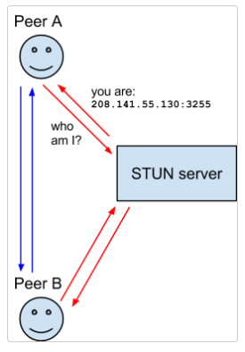

---
sidebar:
  nav: "docs"
title : WebRTC 란
---

WebRTC는 웹 실시간 통신(Web Real-Time Communication)의 약어로,   
웹 브라우저 간에 실시간으로 오디오, 비디오 및 데이터를 전송하기 위한 오픈 표준 기술입니다.   

피어 투 피어(peer-to-peer) 통신을 지원하며, 이는 중간 서버 없이 브라우저 간에 직접 통신할 수 있는 것을 의미합니다.    
(하지만 처음 P2P연결을 위해서 시그널 서버 필요합니다)

WebRTC는 Google, Mozilla, Opera 등의 주요 브라우저 업체들이 개발한 기술로,    
웹 표준화 기구인 W3C(World Wide Web Consortium)와    
IETF(Internet Engineering Task Force)에서 공동으로 표준화되었습니다.   

---

# 참고 사이트

[WebRTC Google 사이트](https://webrtc.org/?hl=ko)   
[WebRTC MDN 사이트](https://developer.mozilla.org/ko/docs/Web/API/WebRTC_API/Protocols)

[https://kid-dev.tistory.com/4](https://kid-dev.tistory.com/4)   
[https://millo-l.github.io/WebRTC-이론_정리하기/](https://millo-l.github.io/WebRTC-%EC%9D%B4%EB%A1%A0-%EC%A0%95%EB%A6%AC%ED%95%98%EA%B8%B0/)

---

# WebRTC 프로토콜   

### ICE(Interactive Connectivity Establishment)   

브라우저가 peer를 통한 연결이 가능하도록 하게 해주는 프레임워크입니다.    

방화벽, 라우터 등 다양한 이유로 피어들 끼리 직접 연결이 되지 않을 때,    
데이터를 릴레이해서 연결을 해야합니다.    
이러한 작업을 위해서 STUN/TURN 서버를 사용합니다.   

### STUN(Session Traversal Utilities for NAT)   

나의 공개 주소(public address)를 발견하거나 peer간의 직접 연결을 막는 등의 라우터의 제한을 결정하는 프로토콜입니다.   

클라이언트는 인터넷을 통해 클라이언트의 공개주소와 라우터의 NAT 뒤에 있는 클라이언트가 접근가능한지에 대한 답변을 위한 요청을 STUN서버에 보냅니다.

### NAT(Network Address Translation)   

네트워크 주소 변환을 의미합니다.   
NAT는 사설 네트워크와 공인 네트워크 간의 통신을 가능하게 해주는 기술입니다.   

사설 네트워크의 장치들이 공인 IP 주소로 변환되어 인터넷에 접속할 수 있도록 도와줍니다.     
외부에서 오는 응답 패킷도 NAT 장치를 거쳐 사설 IP 주소로 다시 변환됩니다.    

어떠한 라우터들은 네트워크에 연결할수 있는 제한을 갖고 있습니다.    
따라서 STUN서버에 의해 공개 IP주소를 발견한다고 해도 모두가 연결을 할수 있다는 것은 아닙니다.   
이를 위해 TURN이 필요합니다.

### TURN(Traversal Using Relays around NAT)   

데이터를 Peer에서 Peer로 직접 전달하지 않고 TURN 서버를 통해 우회하는 것을 의미합니다.    
Symmetric NAT와 같은 제한이 있을때 우회하기 위해서 사용합니다.   

P2P로 직접 데이터가 전달되지 않고, 서버를 통하기 때문에 좀 더 느립니다.   

**<i class="fa fa-info-circle" aria-hidden="true"></i> 정보**    
**Symmetric NAT**   
호스트가 외부 서버에 연결을 요청할 때마다 Symmetric NAT는 임의의 공인 IP 주소와 포트 번호를 할당하여 호스트의 사설 IP 주소와 포트 번호와 매핑합니다.    
이 할당은 해당 호스트의 연결 요청마다 동적으로 이루어지기 때문에 Symmetric NAT라고 불립니다.    
{: .notice--info}

### SDP(Session Description Protocol)   

해상도나 형식, 코덱, 암호화등의 멀티미디어 컨텐츠의 연결을 설명하기 위한 표준입니다.    
이러한 것이 두개의 peer가 다른 한쪽이 데이터가 전송되고 있다는 것을 알게 해줍니다.   
이것은 기본적으로 미디어 컨텐츠 자체가 아닌 컨텐츠에 대한 메타데이터 설명이 됩니다.    

---

# 연결    

### Signaling 
WebRTC는 중간에서 메타데이터 교환을 할 수 있도록 도와주는 서버가 필요합니다.   
중간 서버 없이는 피어간 연결을 생성할 수 없습니다.
여기서 중간에서 도와주는 서버가 시그널링 서버입니다.

시그널링 서버는 피어 간의 통신을 위한 메타데이터 교환을 담당합니다.   
피어간 연결 설정을 도와주는 중개자 역할이라고 생각하면 됩니다.   

### Seession Descriptions
WebRTC 연결에서 엔드포인트의 구성을 Seession Description이라고 합니다.   
Description에는 전송되는 미디어의 종류, 형식, 사용 중인 전송 프로토콜, 엔드포인트의 IP 주소 및 포트, 기타 정보 등이 포함됩니다.    
이 정보는 Seession Description Protocol(SDP)을 사용하여 교환 및 저장됩니다.    

<!-- 1. 피어A가 Offer를 생성, Signal 채널을 통해 피어B에게 Offer전달
2. 피어B는 Offer를 받고, Answer를 생성하고 Signal 채널을 통해 피어A에게 Answer 전달

이러한 방식으로 두 장치는 미디어 데이터를 교환하는 데 필요한 정보를 서로 공유합니다.     -->

이 교환은 두 디바이스가 NAT(네트워크 주소 변환)로 분리되어 있더라도 두 디바이스가 중개자를 사용하여 제안과 응답을 교환할 수 있는 
프로토콜인 ICE(Interactive Connectivity Establishment)를 사용하여 처리됩니다.

새롭게 연결하거나 연결 구성을 바꿀때 Offer/Answer 프로세스로 수행됩니다.   

1. caller가 `MediaDevices.getUserMedia` 통해 로컬 Media를 Capture 합니다.   
2. caller는 `RTCPeerConnection`을 생성하고 `RTCPeerConnection.addTrack()`을 call합니다.   
3. caller는 Offer를 생성하기 위해 `RTCPeerConnection.createOffer()`를 call합니다.   
4. caller는 local description으로 생성한 Offer를 세팅하기위해 `RTCPeerConnection.setLocalDescription()`를 call합니다.   
5. caller는 ice candidates를 생성하기 위해서 STUN서버에 요청합니다.   
6. caller는 receiver에게 Offer를 전달하기 위해 시그널링 서버를 사용합니다.   
7. recipient(수신자)는 Offer를 받고, remote description으로 세팅하기 위해 `RTCPeerConnection.setRemoteDescription()`를 call합니다.   
8. recipient는 call의 종료를 위해 필요한 설정을 합니다.   
9. recipient는 `RTCPeerConnection.createAnswer()`를 호출하여 Answer를 생성합니다.   
10. recipient는 local description으로 해당 Answer를 `RTCPeerConnection.setLocalDescription()`를 호출하여 세팅합니다.   
recipient는 이제 서로 어떻게 연결되어져 있는지 알 수 있습니다.   
11. recipient는 시그널링 서버를 이용하여 caller에게 Answer를 전달 합니다.   
12. caller는 Answer를 받습니다.   
13. caller는 `RTCPeerConnection.setRemoteDescription()`를 호출하여 remote description을 세팅합니다.    
이제 caller도 두 피어의 구성을 알 수 있습니다.    
미디어가 구성된 대로 전달되기 시작합니다.    

### ICE candidates   

피어들은 미디어에 대한 정보를 교환할 뿐만 아니라(위의 Offer/Answer 및 SDP), 네트워크 연결에 대한 정보도 교환해야 합니다.    
이를 ICE candidates라고 하며, 피어가 통신할 수 있는 사용 가능한 방법(직접 또는 TURN 서버를 통해)을 자세히 설명합니다.   
일반적으로 각 피어는 가장 좋은 후보를 먼저 제안하고, 그다음에 더 나쁜 후보로 내려갑니다.     
이상적으로는 UDP를 후보로 삼는 것이 좋지만(더 빠르고 미디어 스트림이 비교적 쉽게 중단을 복구할 수 있기 때문입니다), ICE 표준은 TCP 후보도 허용합니다.   

다이어그램으로 보는 교환되는 프로세스 그림

