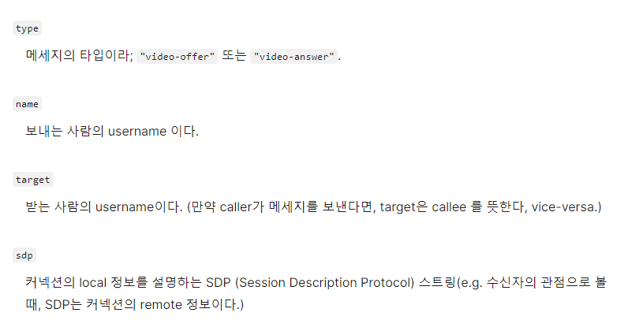
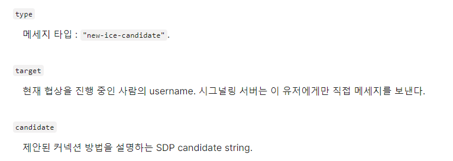
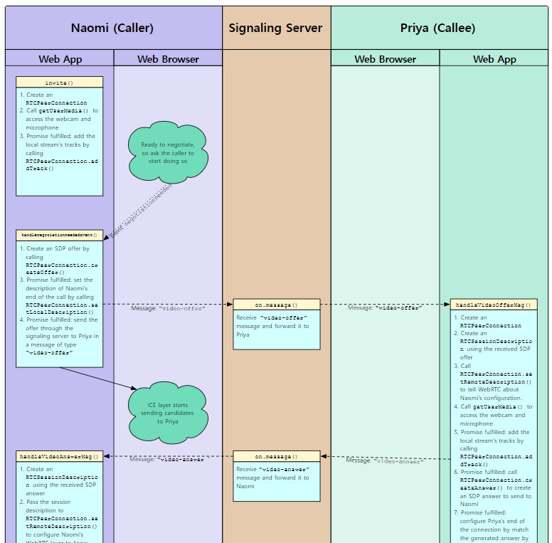
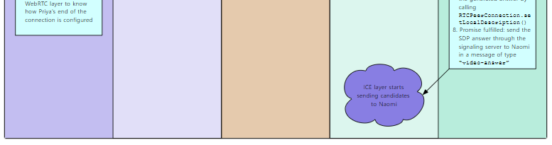
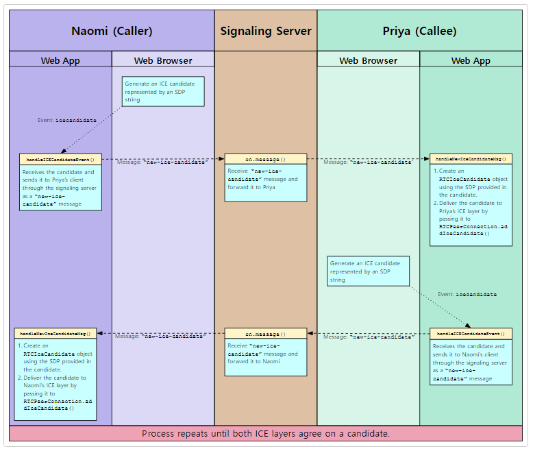

---
sidebar:
  nav: "docs"
title : 시그널링 서버
---

**<i class="fa fa-info-circle" aria-hidden="true"></i> 정보**   
단순하게 MDN 공식 사이트 글을 옮겨 놓은것입니다.   
자세한 내용은 MDN 사이트를 참고하시면 됩니다 😊
{: .notice--info}


서로 다른 네트워크에 있는 2개의 디바이스들을 서로 위치시키기 위해서는,    
각 디바이스들의 위치를 발견하는 방법과 미디어 포맷 협의가 필요하다.     

이 프로세스를 시그널링 signaling 이라 부르고    
각 디바이스들을 상호간에 동의된 서버(socket.io 혹은 websocket을 이용한 서버)에 연결시킨다.   

이 서버는 각 디바이스들이 negotiation(협의) 메세지들을 교환할 수 있도록 한다.   

---

# 참고   

[https://developer.mozilla.org/ko/docs/Web/API/WebRTC_API/Signaling_and_video_calling](https://developer.mozilla.org/ko/docs/Web/API/WebRTC_API/Signaling_and_video_calling)   
[MDN에서 제공하는 소스](https://github.com/mdn/samples-server/tree/master/s/websocket-chat)   
[https://github.com/mdn/samples-server/blob/master/s/webrtc-from-chat/chatserver.js](https://github.com/mdn/samples-server/blob/master/s/webrtc-from-chat/chatserver.js)

---

# 시그널링을 위한 채팅 서버 준비   
chat server 는 클라이언트와 서버 사이에 WebSocket API을 통해 JSON string으로 데이터를 전송한다.   

시그널링과 ICE negotiation 을 서버가 처리하기 위해서 코드를 작성해야한다.    

모든 로그인된 유저들에게 브로드캐스팅하는 것이 아니라, 특정한 유저에게 직접 메세지를 전달해야한다.   

이 개념은 WebRTC가 아니라 WebSocket에 관한 개념이다.    

```javascript
function sendToOneUser(target, msgString) {
  var isUnique = true;
  var i;

  for (i=0; i<connectionArray.length; i++) {
    if (connectionArray[i].username === target) {
      connectionArray[i].sendUTF(msgString);
      break;
    }
  }
}
```
특정 User에게만 메세지를 보낸다.   

```javascript
if (sendToClients) {
  var msgString = JSON.stringify(msg);
  var i;

  // If the message specifies a target username, only send the
  // message to them. Otherwise, send it to every user.
  if (msg.target && msg.target !== undefined && msg.target.length !== 0) {
    sendToOneUser(msg.target, msgString);
  } else {
    for (i=0; i<connectionArray.length; i++) {
      connectionArray[i].sendUTF(msgString);
    }
  }
}
```
target이 존재할 경우 특정 유저에게만 메시지를 보내고   
target이 없을 경우 모든 유저들에게 메시지를 보낸다. (브로드케스트)   

---

# 시그널링 프로토콜 설계   
stringified JSON object 을 가지고 서버와 클라언트간에 데이터를 주도록 설계   

---

# Session Descriptions 교환   
시그널링 프로세스를 시작할 때, call을 시작 하는 유저가 **offer**란 것을 만든다.   
이 offer는 세션 정보를 SDP 포맷으로 가지고 있으며, 커넥션이 이어지기를 원하는 유저(callee)에게 전달되어야 한다.   
Callee 는 이 offer에 SDP description을 포함하는 **answer**메세지를 보내야한다.     
우리가 사용할 offer 메세지들은 `"video-offer"` 이라는 타입을 사용할 것이고 answer 메세지들은 `"video-answer"` 타입의 메세지를 사용할 것이다.  
이 메세지들은 아래와 같은 field를 가진다. 



---

# ICE candidates 교환   
SDP를 서로 교환한 후에, 두 피어들은 ICE candidate(ICE 후보)들을 교환하기 시작한다.     
각 ICE candidate는 발신 피어 입장에서 통신을 할 수 있는 방법을 설명한다.    
각 피어는 검색되는 순서대로 candidate를 보내고 미디어가 이미 스트리밍을 시작 했더라도 모든 가능한 candidate가 전송 완료될 때까지 계속 보낸다.    
두 피어가 서로 호환되는 candidate를 제안했다면, 미디어는 통신을 시작한다.   
만약 나중에 더 나은 방법이 있다면(더 높은 성능을 가지는), 그 스트림은 필요에 따라 포맷을 바꿀 수도 있다.    

시그널링 서버를 통해 전달되는 ICE candidate들에 관한 메세지의 타입은 "new-ice-candidate" 이며, 이 메세지들은 아래 field를 가진다.   



각 ICE 메세지들은 두 개의 컴퓨터를 서로 연결하기 위한 정보들에 덧붙여 프로토콜(TCP or UDP), IP 주소, 포트 넘버, 커넥션 타입 등을 제안한다.    
여기에는 NAT 혹은 다른 복잡한 네트워킹을 포함한다.   

**<i class="fa fa-info-circle" aria-hidden="true"></i> 정보**   
ICE negotiation 동안 너의 코드가 해야할 것은 오직 ICE layer에서 외부로 나갈 candidate들을 선택하는 것과,   icecandidate_eventhandler가 불렸을 때 시그널링 서버를 통해 그것들을 다른 피어에 보내는 것이다.    
그리고 시그널링서버로부터 ICE candidate 메세지를 받고 RTCPeerConnection.addIceCandidate()를 호출하여    
너의 ICE layer에 그들을 전달한다.   
{: .notice--info}

---

# 시그널링 transaction 흐름   
시그널링 정보는 연결할 두 피어들 사이에서 교환된다.   






# ICE candidate 교환 프로세스   
각 피어들의 ICE layer에서 candidate들을 보내기 시작할 때, 다음 그림과 같은 교환이 일어난다.   



각 피어들은 candidate 들을 전송하고, 준비가 되면 받은 candidate 들을 처리한다.    
Candidate들은 양 피어들이 동의할 때까지 계속 교환되며, 미디어가 송수신 되도록 만든다.   
"ICE exchange"은 양측이 교대로 제안을하는 것을 의미하지 않는다.    
올바르게 작동할 경우, 각 피어들은 모두 소진되거나 서로 동의할 때까지 상대방에게 제안할 candidate 들을 계속 전송한다.

만약 조건들이 바뀐다면, 예를들어 네트워크 커넥션이 악화되면, 하나 혹은 양 피어들은 낮은 bandwidth의 미디어 해상도로 바꾸거나 다른 코덱을 사용하자고 제안할 것이다.    
다음 candidate 교환에서 양 피어 모두 새로운 포맷에 동의한다면,    
다른 미디어 포맷 혹은 다른 코덱으로 바뀔 수도 있다.

---

# Client Applcation   
