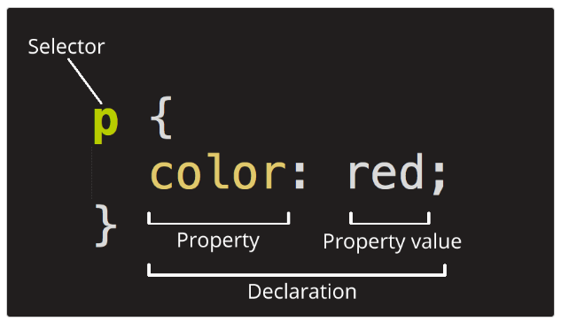
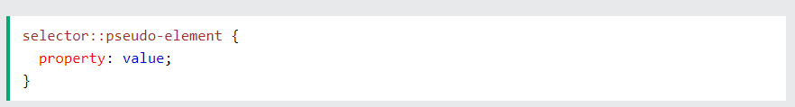

---
sidebar:
  nav: "docs"
title : CSS 기초
---

CSS(Cascading Style Sheets)
Cascading : 폭포, 떨어지다, 쏟아지다, ~을 겹쳐서 표시하다

웹페이지를 꾸미려고 작성하는 코드

프로그래밍 언어는 아니고 단순히 Style sheet 언어입니다. 

html파일 head 안쪽에 
```html
<link href="styles/style.css" rel="stylesheet" type="text/css">
```
코드 삽입   

   


여러 요소 선택하기

```css
p,li,h1 {
  color: red;
}
```


```css
body {
  margin: 0 auto;
  padding: 0 20px 20px 20px;
  border: 5px solid black;
}
```

+ margin: 0 auto : 첫 번째 값은 요소의 상단과 하단에 영향을 주고 (예시에서는 0),
두 번째 값은 좌측과 우측에 영향을 줍니다.  (여기서, auto 는 가능한 수평공간의 왼쪽과 오른쪽을 같게 나눠주는 특별한 값입니다)

+ border: 5px solid black : 5 pixels 두깨의 실선으로 설정   

이미지 가운데 정렬   

```css
img {
  display: block;
  margin: 0 auto;
}
```
margin: 0 auto 트릭을 사용해 볼 수 있지만, 무언가 더 해야할 필요가 있습니다.   
body 요소는 block level 입니다    
이것은 페이지의 공간을 차지하고, margin 과 여기에 적용된 다른 여백값을 가질 수 있다는 것을 의미합니다.   
반면에 이미지는 inline 요소 입니다. 이것은 그렇지 못함을 의미합니다.    
따라서 이미지에 margin 을 적용하기 위해서는, display: block; 을 사용해 이미지에 block-level 성질을 주어야 합니다.    
 

CSS 는 실제로 어떻게 작동합니까?

브라우저가 문서를 표시할 때, 문서의 콘텐츠와 해당 스타일 정보를 결합해야 합니다. 아래 나열된 여러 단계로 문서를 처리합니다. 이것은 브라우저가 웹 페이지를 로드할 때 발생하는 작업의 매우 단순화된 버전이며, 다른 브라우저가 다른 방식으로 작업을 처리한다는 점을 명심하십시오. 그러나 이것은 대략 일어나는 일입니다.

브라우저는 HTML (예: 네트워크에서 HTML 을 수신) 을 로드합니다.
HTML 을 DOM (Document Object Model) 로 변환합니다. DOM 은 컴퓨터 메모리의 문서를 나타냅니다. DOM 은 다음 섹션에서 좀 더 자세히 설명됩니다.
그런 다음 브라우저는 포함된 이미지 및 비디오와 같은 HTML 문서에 연결된 대부분의 리소스와 연결된 CSS 를 가져옵니다! JavaScript 는 작업에서 나중에 처리되므로 더 간단하게 하기위해 여기에서는 다루지 않습니다.
브라우저는 가져온 CSS 를 구문 분석하고 선택자 유형별로 다른 규칙을 다른 "buckets" 으로 정렬합니다. 예: 요소, class, ID 등 찾은 선택자를 기반으로 DOM 의 어느 노드에 어떤 규칙을 적용해야 하는지 결정하고, 필요에 따라 스타일을 첨부합니다 (이 중간 단계를 render tree 라고 합니다).
render tree 는 규칙이 적용된 후에 표시되어야 하는 구조로 배치됩니다.
페이지의 시각적 표시가 화면에 표시됩니다 (이 단계를 painting 이라고 함).
다음 그림은 작업의 간단한 보기를 제공합니다.


```css
<p>
  Let's use:
  <span>Cascading</span>
  <span>Style</span>
  <span>Sheets</span>
</p>
```

DOM 에서, <p> 요소에 해당하는 노드는 부모입니다. 자식은 텍스트 노드이고 <span> 요소에 해당하는 세 개의 노드입니다. SPAN 노드는 부모이며, 텍스트 노드는 자식입니다:


```
P
├─ "Let's use:"
├─ SPAN
|  └─ "Cascading"
├─ SPAN
|  └─ "Style"
└─ SPAN
   └─ "Sheets"
```

 
기본적으로 배경 이미지 속성은 이미지를 가로 및 세로로 반복합니다.     

위 이미지를 가로로만 반복하면(배경 반복: 반복-X;) 배경이 더 보기 좋아집니다    

```css
body {
  background-image: url("gradient_bg.png");
  background-repeat: repeat-x;
}
```


background-attachment 속성은 배경 이미지를 스크롤할지 고정할지(페이지의 나머지 부분과 함께 스크롤되지 않음)를 지정합니다   

```css
body {
  background-color: #ffffff;
  background-image: url("img_tree.png");
  background-repeat: no-repeat;
  background-position: right top;
}
```

를

```css
body {
  background: #ffffff url("img_tree.png") no-repeat right top;
}
```

이렇게 단축(Shorthand)시킬 수 있음 


#### CSS Margins    

CSS Margins 속성은 정의된 테두리 외부에 요소 주위에 공간을 만드는 데 사용됩니다.

CSS를 사용하면 여백을 완전히 제어할 수 있습니다. 요소의 각 면(위쪽, 오른쪽, 아래쪽, 왼쪽)에 대한 여백을 설정하는 속성이 있습니다.    

모든 마진 속성은 다음과 같은 값을 가질 수 있습니다:

auto - 브라우저가 여백을 계산합니다.
length - 여백을 px, pt, cm 등으로 지정합니다.
% - 포함 요소 너비의 % 단위로 여백을 지정합니다.
inherit - 부모 요소에서 여백을 상속하도록 지정합니다.  

#### Margin - Shorthand Property    
margin: 25px 50px 75px 100px;
top margin is 25px
right margin is 50px
bottom margin is 75px
left margin is 100px

#### Margin Collapse    
요소의 위쪽 및 아래쪽 여백은 두 여백 중 가장 큰 여백과 동일한 단일 여백으로 축소되는 경우가 있습니다.

왼쪽과 오른쪽 여백에서는 이런 일이 발생하지 않습니다! 위쪽과 아래쪽 여백만!   

#### CSS Padding   
테두리 내부에 요소의 콘텐츠 주위에 공간을 생성하는 데 사용됩니다.   


#### CSS Setting height and width   

높이 및 너비 속성에는 패딩, 테두리 또는 여백이 포함되지 않습니다. 요소의 패딩, 테두리 및 여백 내부 영역의 높이/너비를 설정합니다.   

auto - 기본값입니다. 브라우저가 높이와 너비를 계산합니다.
length - 높이/너비를 px, cm 등으로 정의합니다.
% - 포함 블록의 백분율로 높이/너비를 정의합니다.
initial - 높이/너비를 기본값으로 설정합니다.
inherit - 높이/너비가 부모 값에서 상속됩니다.   


#### The CSS Box Model   


Content - 텍스트 및 이미지가 표시되는 상자의 콘텐츠입니다.
Padding - 콘텐츠 주변 영역을 지웁니다. 패딩은 투명합니다.
Border - 패딩과 콘텐츠를 둘러싸는 테두리입니다.
Margin - 테두리 외부의 영역을 지웁니다. 여백은 투명합니다.

**<i class="fa fa-info-circle" aria-hidden="true"></i> 중요**   
CSS로 요소의 너비 및 높이 속성을 설정할 때는 콘텐츠 영역의 너비와 높이만 설정하면 됩니다. 요소의 전체 크기를 계산하려면 패딩, 테두리 및 여백도 추가해야 합니다. 
{: .notice--info}   

```
320px (width)
+ 20px (left + right padding)
+ 10px (left + right border)
+ 0px (left + right margin)
= 350px
```

#### CSS Outline
outline은 요소를 "돋보이게" 하기 위해 테두리 외부에 요소 주위에 그려지는 선입니다.


#### text-align     
텍스트의 수평 정렬을 설정하는 데 사용됩니다.

#### vertical-align    
요소의 수직 정렬을 설정합니다.   


# CSS Layout - The display Property   

디스플레이 속성은 레이아웃을 제어하는 데 가장 중요한 CSS 속성입니다.

#### The display Property   

모든 HTML 요소에는 요소 유형에 따라 기본 표시 값이 있습니다.   
대부분의 요소의 기본 표시 값은 Block 또는 Inline입니다.    

#### Block-level Elements   
블록 수준 요소는 항상 새 줄에서 시작하며 사용 가능한 전체 너비를 차지합니다(가능한 한 좌우로 뻗어 있음).

#### Inline Elements    
인라인 요소는 새 줄에서 시작되지 않고 필요한 만큼의 너비만 차지합니다     

#### Display: none;   
숨기기 위해 사용됩니다    

#### Override The Default Display Value   
앞서 언급했듯이 모든 요소에는 기본 표시 값이 있습니다. 그러나 이를 재정의할 수 있습니다.

인라인 요소를 블록 요소로 변경하거나 그 반대로 변경하면 웹 표준을 따르면서도 페이지를 특정 방식으로 보이게 하는 데 유용할 수 있습니다.

일반적인 예로는 가로 메뉴에 인라인 <li> 요소를 만드는 것이 있습니다:


**<i class="fa fa-info-circle" aria-hidden="true"></i> 정보**   
요소의 표시 속성을 설정하면 요소가 표시되는 방식만 변경되며 요소의 종류는 변경되지 않습니다.   
따라서 display: block이 있는 인라인 요소는 그 안에 다른 블록 요소를 포함할 수 없습니다.
{: .notice--info}   


# CSS Layout - The position Property
요소에 사용되는 위치 지정 방법의 유형(static, relative, fixed, absolute or sticky)을 지정합니다.    

HTML 요소는 기본적으로 static으로 배치됩니다.

#### position: static;
static으로 배치된 요소는 위, 아래, 왼쪽, 오른쪽 속성의 영향을 받지 않습니다.

position이 static인 요소는 특별한 방식으로 배치되지 않으며 항상 페이지의 일반적인 흐름에 따라 배치됩니다:

#### position: relative;    
position: relative인 요소는 정상 위치에 상대적인 위치를 갖습니다.

relatively-positioned한 요소의 top, right, bottom, left 속성을 설정하면   
해당 요소가 normal position에서 멀어지도록 조정됩니다.   

#### position: fixed;    
`position: fixed;`인 요소는 viewport를 기준으로 배치되므로 페이지가 스크롤되더라도 항상 같은 위치에 유지됩니다.   
요소의 위치는  top, right, bottom, left 속성을 사용하여 지정합니다.

#### position: absolute;   
`position: absolute;`인 요소는 fixed과 같이 viewport를 기준으로 position 되는 대신에 
가장 가까운 위치에 있는 상위 요소에 상대적으로 position 되게 됩니다.

그러나 absolute position된 요소에 position이 지정된 상위 요소가 없는 경우  
document body을 사용하며 페이지 스크롤에 따라 이동합니다.

**<i class="fa fa-info-circle" aria-hidden="true"></i> 정보**   
absolute position된 요소는 normal flow에서 제거되며 요소와 겹칠 수 있습니다.   
{: .notice--info}   

#### position: sticky;   
`position: sticky;`인 요소는 사용자의 스크롤에 따라 position 됩니다.   
sticky 요소는 스크롤 위치에 따라 relative와 fixed 사이를 전환합니다.  
viewport에서 지정된 오프셋 위치에 도달할 때까지 상대적인 위치로 배치되며,    
그 이후에는 `position:fixed`과 같이 제자리에 "고정"됩니다.    

#### The z-index Property   
`z-index` 속성은 요소의 스택 순서를 지정합니다.    

요소를 배치할 때 다른 요소와 겹칠 수 있습니다.   

# CSS Layout - Overflow    
CSS `overflow` 속성은 콘텐츠가 너무 커서 영역에 맞지 않을 때, 컨텐츠에 어떤 일이 발생할지 결정합니다.    

`overflow` 속성은 요소의 콘텐츠가 너무 커서 지정된 영역에 맞지 않을 때   
콘텐츠를 잘라낼지 스크롤바를 추가할지 여부를 지정합니다.    

`visible` - 기본값입니다. overflow가 잘리지 않습니다. 콘텐츠가 요소의 상자 외부에 렌더링됩니다.     
`hidden` - overflow가 잘리고 나머지 콘텐츠는 보이지 않습니다.    
`scroll` - overflow가 잘리고 나머지 콘텐츠를 볼 수 있도록 스크롤바가 추가됩니다.    
`auto` - 스크롤과 유사하지만 필요할 때만 스크롤바를 추가합니다.    

#### overflow-x and overflow-y   
`overflow-X` 및 `overflow-Y` 속성은 콘텐츠의 `overflow`를 가로로만 변경할지, 세로로만 변경할지(또는 둘 다 변경할지) 지정합니다:

# CSS Layout - float and clear   
CSS `float` 속성은 요소의 부동 방식을 지정합니다.    
CSS `clear` 속성은 cleared된 요소 옆에 띄울 수 있는 요소와 어느 쪽에 띄울 수 있는 요소를 지정합니다.    

#### The float Property   
`float` 속성은 컨테이너의 텍스트 왼쪽에 이미지를 띄우는 등 콘텐츠의 위치를 지정하고 서식을 지정하는 데 사용됩니다.

`left` - 요소가 컨테이너의 왼쪽에 떠 있습니다.   
`right` - 요소가 컨테이너의 오른쪽에 떠 있습니다.   
`none` - 요소가 float되지 않습니다(텍스트에서 해당 위치에만 표시됨). 이게 기본값입니다.   
`inherit` - 요소가 부모의 부동 소수점 값을 상속합니다.   
가장 간단한 용도로 float 속성을 사용하여 이미지 주위에 텍스트를 둘러싸는 데 사용할 수 있습니다.   

#### The clear Property   
float 속성을 사용하는 경우 다음 요소를 오른쪽이나 왼쪽이 아닌 아래에 표시하려면 clear 속성을 사용해야 합니다.

clear 속성은 플로팅 요소 옆에 있는 요소에 어떤 일이 일어날지 지정합니다.

`none` - 요소가 왼쪽 또는 오른쪽 부동 요소 아래로 밀리지 않습니다. 기본값은 다음과 같습니다.
`left` - 요소가 왼쪽 부동 요소 아래로 밀려납니다.
`right` - 요소가 오른쪽 부동 요소 아래로 밀려납니다.
`both` - 요소가 왼쪽 및 오른쪽 부동 요소 모두 아래로 푸시됩니다.
`inherit` - 요소가 부모로부터 clear 값을 상속합니다.
플로트를 clear시킬 때는 clear를 플로트와 일치시켜야 합니다   
요소가 왼쪽으로 떠 있는 경우 왼쪽으로 지워야 합니다.   
플로팅된 요소는 계속 플로팅되지만 clear된 요소는 웹 페이지에서 그 아래에 표시됩니다.   

#### The display: inline-block Value   
`display: inline`과 비교할 때 가장 큰 차이점은 `display: inline-block` 은 요소에 너비와 높이를 설정할 수 있다는 점입니다.   

또한 `display: inline-block`을 사용하면 위쪽 및 아래쪽 여백/패딩이 존중되지만 `display: inline`을 사용하면 그렇지 않습니다.   

`display: block`과 비교할 때 가장 큰 차이점은 `display: inline-block`은 요소 뒤에 줄 바꿈을 추가하지 않으므로 요소가 다른 요소 옆에 위치할 수 있다는 점입니다.   

#### Center Align Elements   
block 요소(예: <div>)를 가로로 가운데에 배치하려면 `margin: auto;`을 사용합니다   

요소의 너비를 설정하면 요소가 컨테이너의 가장자리까지 늘어나지 않습니다.   

그러면 요소가 지정된 너비를 차지하게 되고 나머지 공간은 두 여백으로 균등하게 분할됩니다   

**<i class="fa fa-info-circle" aria-hidden="true"></i> 참고**   
너비 속성이 설정되어 있지 않거나 100%로 설정되어 있으면    
가운데 정렬이 적용되지 않습니다.
{: .notice--info}   

#### Center Align Text   
요소 내부의 텍스트를 가운데에 배치하려면 `text-align: center;`를 사용합니다   

#### Center an Image   
이미지를 가운데에 배치하려면 왼쪽 및 오른쪽 여백을 `auto`으로 설정하고 `block` 요소로 만듭니다.   

#### Left and Right Align - Using position   
요소를 정렬하는 한 가지 방법은 `position: absolute;`을 사용하는 것입니다   

**<i class="fa fa-info-circle" aria-hidden="true"></i> 참고**   
Absolute로 배치된 요소는 normal flow에서 제거되며 요소와 겹칠 수 있습니다.
{: .notice--info}  

#### Left and Right Align - Using float   
요소를 정렬하는 또 다른 방법은 float 속성을 사용하는 것입니다   

#### The clearfix Hack   
요소가 부모 컨테이너 요소 보다 크고 float된 경우   
해당 요소가 컨테이너 밖으로 넘쳐흐르게 됩니다.   
이 문제를 해결하기 위해 "clearfix hack"을 사용할 수 있습니다


```css
.clearfix::after {
  content: "";
  clear: both;
  display: table;
}
```   

#### Center Vertically - Using padding  
CSS에서 요소를 세로로 중앙에 배치하는 방법에는 여러 가지가 있습니다.   
간단한 해결책은 위쪽과 아래쪽 패딩을 사용하는 것입니다

```css
.center {
  padding: 70px 0;
  border: 3px solid green;
}
```

세로 및 가로 모두 가운데에 배치하려면 
`padding` 및 `text-align: center`를 사용합니다   

---

#### Center Vertically - Using line-height   
또 다른 방법은 `height` 속성과 같은 값으로
`line-height` 속성을 설정하는 것입니다   

---

#### Center Vertically - Using position & transform   
`padding `과 `line-height`가 옵션이 아닌 경우   
다른 해결책은 위치 지정과 `transform` 속성을 사용하는 것입니다   

```css
.center {
  height: 200px;
  position: relative;
  border: 3px solid green;
}

.center p {
  margin: 0;
  position: absolute;
  top: 50%;
  left: 50%;
  transform: translate(-50%, -50%);
}
```
---

#### Center Vertically - Using Flexbox   
flexbox를 사용하여 사물을 중앙에 배치할 수도 있습니다.  
flexbox는 IE10 및 이전 버전에서는 지원되지 않는다는 점에 유의하세요   


```css
.center {
  display: flex;
  justify-content: center;
  align-items: center;
  height: 200px;
  border: 3px solid green;
}
```   

#### CSS Combinators   
combinator는 선택자 간의 관계를 설명하는 요소입니다.   

CSS 선택기에는 하나 이상의 simple 선택기가 포함될 수 있습니다.   
simple 선택기 사이에는 combinator를 포함할 수 있습니다.   

하위 선택기(공백) - descendant selector   
자식 선택기 (>) - child selector   
인접 형제 선택기(+) - adjacent sibling selector   
일반 형제 선택기(~) - general sibling selector   

---

#### Descendant Selector   
하위 선택기는 지정된 요소의 하위 요소인 모든 요소와 match 됩니다.   
자식의 자식 하위에 있는 요소는 모두 match 됩니다.   

---

#### Child Selector (>)   
자식 선택기는 지정된 요소의 자식인 모든 요소를 선택합니다.   

---

#### djacent Sibling Selector (+)   
인접한 형제 선택기는 다른 특정 요소 바로 뒤에 있는 요소를 선택하는 데 사용됩니다.   

형제 요소는 동일한 상위 요소를 가져야 하며, "인접"은 "바로 다음"을 의미합니다.  

---

#### General Sibling Selector (~)   
일반 형제 선택기는 지정된 요소의 다음 형제인 모든 요소를 선택합니다.

---

#### CSS Pseudo-classes   
pseudo-class는 요소의 특수 상태를 정의하는 데 사용됩니다.

+ 사용자가 요소 위로 마우스를 가져갈 때 요소 스타일 지정하기   
+ 방문한 링크와 방문하지 않은 링크의 스타일 다르게 지정   
+ 포커스를 받을 때 요소 스타일 지정   

```css
/* unvisited link */
a:link {
  color: #FF0000;
}

/* visited link */
a:visited {
  color: #00FF00;
}

/* mouse over link */
a:hover {
  color: #FF00FF;
}

/* selected link */
a:active {
  color: #0000FF;
}
```

---

#### CSS Pseudo-elements   
CSS pseudo-element 는 요소의 지정된 부분에 스타일을 지정하는 데 사용됩니다.   

+ 요소의 첫 글자 또는 줄 스타일 지정하기   
+ 요소의 콘텐츠 앞이나 뒤에 콘텐츠 삽입하기   



---

#### Navigation Bar   
A navigation bar은 기본적으로 list of links이므로   
`<ul>` 및 `<li>` 요소를 사용하는 것이 가장 적합합니다    

```html
<ul>
  <li><a href="default.asp">Home</a></li>
  <li><a href="news.asp">News</a></li>
  <li><a href="contact.asp">Contact</a></li>
  <li><a href="about.asp">About</a></li>
</ul>
```

```css
ul {
  list-style-type: none;
  margin: 0;
  padding: 0;
}
```

+ `list-style-type: none;` - 글머리 기호를 제거합니다.   
+ navigation bar에는 목록 마커가 필요하지 않습니다.    
+ `margin: 0;` 및 `padding: 0;` 설정 - 브라우저 기본 설정을 제거합니다.   

---

#### Horizontal Navigation Bar   
horizontal navigation bar을 만드는 방법에는 두 가지가 있습니다.   
`inline` 또는 `floating` list items 사용.   

----

#### Inline List Items   
```css
li {
  display: inline;
}
```

기본적으로 `<li>` 요소는 블록 요소입니다.   
여기서는 각 목록 항목 앞뒤의 줄 바꿈을 제거하여 한 줄에 표시합니다.   

---

#### loating List Items   
horizontal navigation bar을 만드는 또 다른 방법은 `<li>` 요소를 float하고 navigation links의 레이아웃을 지정하는 것입니다.   

+ `float: left;` - 블록 요소를 서로 옆에 띄우려면 float를 사용합니다.   
+ `display: block;` - 원하는 경우 패딩(및 높이, 너비, 여백 등)을 지정할 수 있습니다.   
+ `padding: 8px;` - 각 `<a>` 요소 사이에 약간의 패딩을 지정하여 보기 좋게 만듭니다.   
+ `background-color: #dddddd;` - 각 `<a>` 요소에 회색 배경색을 추가합니다.   

---


