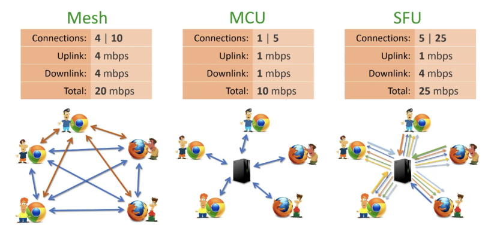

---
sidebar:
  nav: "docs"
title : WebRTC Server 구조도 종류
---
**<i class="fa fa-info-circle" aria-hidden="true"></i> 정보**   
WebRTC의 원래 구현은 P2P(피어 투 피어) 통신만 지원하는 것으로 알려졌으며,    
P2P에서 각 참가자는 활성 연결/데이터 채널을 통해 다른 모든 참가자와 직접 연결됩니다.  
{: .notice--info}




# mesh (P2P, signaling)   
모든 피어들이 개별적으로 비디오/오디어 데이터를 전송하고, 다른 모든 피어들의 비디오/오디오 데이터를  받습니다.   

모든 피어가 N명인 경우, 총 연결 수는 O(N²)로 증가하므로 인원 수가 많아지면 과부하가 걸릴 수 있습니다.       

#### 장점
```s
 - 지연 시간이 매우 짧습니다(실제로는 가장 짧습니다)   
 - 서버가 필요하지 않으므로 운영 비용이 거의 들지 않습니다(실제로는 시그널 서버와 스턴/턴 서버 필요)
```

#### 단점
```s
 - 확장성이 떨어짐(8명 이상 지원하기 어려움)
 - NAT 문제로 STUN/TURN 서버로 우회하는게 가능하지만 차단 되는 경우가 있을 수 있음
 - 엔드포인트 과부하 : 각 피어들이 각각 N-1 개 만큼 송수신을 하기 때문에 과부하가 걸릴 수 있음
```

#### MCU(Multi-point Control Unit)    
각 피어들은 MCU 서버와 연결 됩니다.   
MCU 서버는 각 피어들로부터 미디어를 수신받고 하나로 합친 후에 다시 각 피어들에게 전송합니다.   
각 피어는 1개의 Connection로 업로드하고, 다운로드 또한 1개의 Connection로 다운 받습니다.    
각 피어는 결국 2개의 Connection만 있으면 됩니다.

**<i class="fa fa-info-circle" aria-hidden="true"></i> 정보**   
비디오 스트림에서 미디어 처리(예: OpenCV)를 실행하거나 사용자 지정 배경/블러를 도입하려는 경우, 
MCU가 가장 좋은 방법일 수 있습니다.   
또한 MCU는 미디어 레이아웃을 결정하며 최종 사용자가 미디어 레이아웃을 제어하는데 제한이 있습니다.
{: .notice--info}

#### 장점
```s
 - 낮은 대역폭 환경에서 특히 잘 작동함
 - 참가자 수가 증가함에 따라 확장성이 매우 뛰어남
```

#### 단점
```s
 - 서버가 모든 피어들의 스트림을 믹싱하기 때문에 서버의 CPU 많이 사용하게 됨
 - 서버 CPU 과부하 및 믹싱 과정에서 지연 시간이 증가함
```

#### SFU(Selective Forwarding Unit)   
모든 피어들이 SFU 서버와 연결 됩니다.    
SFU 서버는 단순히 전달만 하는 역할을 할 뿐입니다.

각 피어들은 하나의 스트림만 업로드하고, 나머지 N-1개의 스트림을 수신하게 됩니다.   
대부분 가정에서 업링크 대역폭이 약하지만, 다운링크 속도가 빠르기 때문에 괜찮은 방법입니다.   

#### 장점
```s
 - 서버 부하를 낮추면서 확장성이 매우 뛰어납니다.
 - 배경 흐림 및 비디오 레이아웃과 같은 특정 기능은 각 피어에서 보내면 됩니다.
```

#### 단점
```s
 - 보안이 문제가 될 수 있습니다.
```
