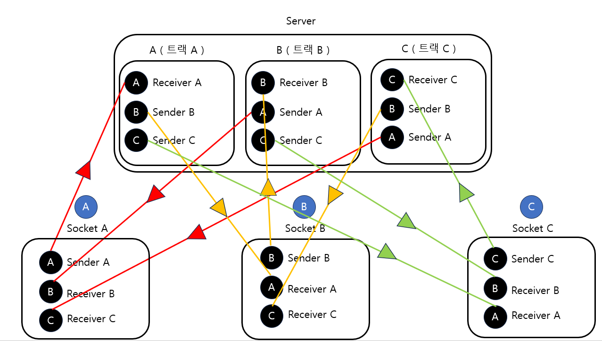

---
sidebar:
  nav: "docs"
title : SFU 
---

#### 참고 사이트

[Simple SFU](https://github.com/tiger2380/simple_sfu/blob/master/server.js)   

[https://millo-l.github.io/WebRTC-%EA%B5%AC%ED%98%84%ED%95%98%EA%B8%B0-1-N-SFU/](https://millo-l.github.io/WebRTC-%EA%B5%AC%ED%98%84%ED%95%98%EA%B8%B0-1-N-SFU/)

[https://github.com/mkhahani/mediasoup-sample-app/tree/master](https://github.com/mkhahani/mediasoup-sample-app/tree/master)

---

mdeiasoup을 이용해도 좋고    

아니면 직접 아래와 같은 구조로 하면 될 것 같다.    
직접 해보지는 않아서 참고 정도만 하면 좋을 것 같다 😊

  

---

