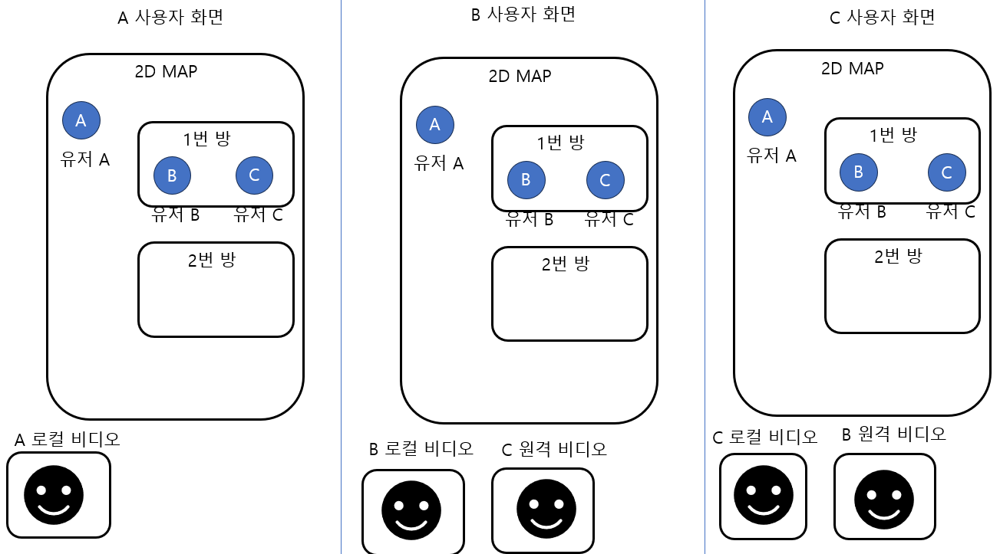
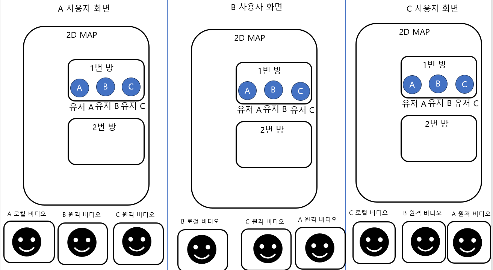
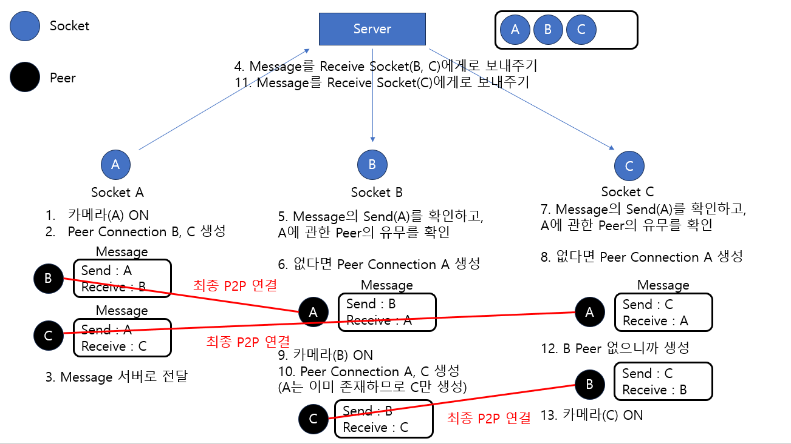

---
sidebar:
  nav: "docs"
title : WebRTC ZEP 처럼 구현해보기
---

ZEP 에서는 2D Tile Map에서 캐릭터을 방향키로 움직일 수 있고 서로 같은 공간(방)에 있을경우
서로 화상채팅과 채팅이 가능합니다.   

아래 그림을 참고하세요

외부에 있는 A는 자신의 로컬 비디오 스트림만 보이고,
1번방에 있는 B와 C는 로컬 비디오와 서로에 대한 원격 비디오 스트림이 보입니다.

A,B,C 모두 1번방에 있게 되므로   
모두 각각에 대한 로컬 비디오와 원격 비디오들이 모두 보이게 됩니다.   

이제, 기본적인 P2P를 mesh구조로 어떻게 연결 시킬지 보겠습니다.   

# P2P Mesh 구조       

Offer, Answer, ICE 등은 생략하고, 단순하게 그려봤습니다.  
A에서 Camera를 ON하게 되면, 
A에서 상대방 Peer인 B와 C를 생성하게 됩니다.   

시그널링 서버를 통해서 상대방 B,C에게 각각 메시지를 보내게 됩니다.   
상대방 쪽에서 Peer A가 아직 없다면 생성하고, 서로 연결 동작을 수행하여 P2P 연결이 완료 됩니다.   

이렇게 똑같이 B, C에서도 수행하면 서로 모두 연결되게 됩니다.   

# 피어 끊기   
같은 방에 있는 사람들 끼리는 Peer가 서로 연결되어져 있지만   
다른 방으로 가거나 방에서 나간경우 피어를 끊어야 합니다.   

로컬 피어를 중단하고, 시그널링 서버를 통해서 상대방 피어에게도 알려 줬습니다.   

# 방에 새롭게 진입했을때, 기존에 있던 사람들의 카메라가 켜져 있던 경우  (진입자 케마라는 OFF) 

이 경우, 방에 진입하자마자 상대방과의 피어가 자동으로 연결되고 스트림이 보여야 합니다.    

시그널링 서버를 이용해서, 같은 방에 새로운 유저가 들어 왔을때   
해당 유저들에게 새로운 사용자가 들어왔다고 같은 방 유저 모두에게 알립니다.      

이때 각 유저의 로컬 스트림이 진행중인지 확인 합니다.    

만약 로컬 스트림이 진행중(카메라 ON) 이라면, 피어 연결이 되지 않은 유저에게로    
Offer를 보내고 answer를 받으며 ice-candidate 통신을 주고 받으면서 연결이 되도록 합니다.   
또한 track을 peer에 추가해서 스트림을 보내줍니다.   

이렇게 하면 방에 진입했을 때, 자동으로 피어 연결이 되고 상대방 스트림이 보이게 됩니다.   

# 방에 새롭게 진입했을때, 기존에 있던 사람들의 카메라가 켜져 있던 경우  (진입자 케마라는 ON)    
진입 하려는는 유저도 카메라가 ON이고, 기존에 있던 사람들도 카메라가 ON일 경우    
서로 Offer를 보내려고 하게 됩니다.    
이렇게 되면 setDescription 과정에서 locaDescription과 remoteDescription이 맞지 않는 상황이 발생하게 됩니다.   

시그널링 서버에서 위와 같은 상황일 때는   
유저의 ID값이 더 작은 녀석이 Offer를 보내주는 걸로 해서 해결했습니다.   

실력이 부족하여 많이 복잡하게 만든 것 같습니다. ㅠㅠ😂        
참고 정도만 해주세요 😊    

