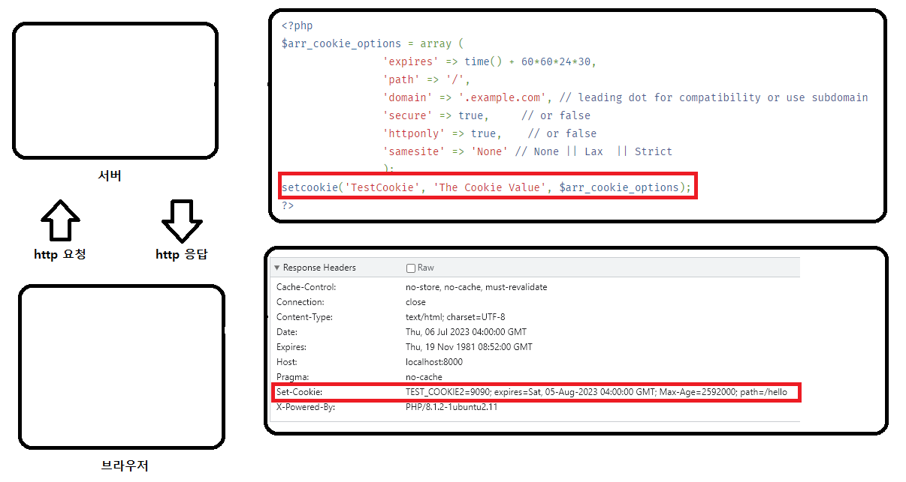
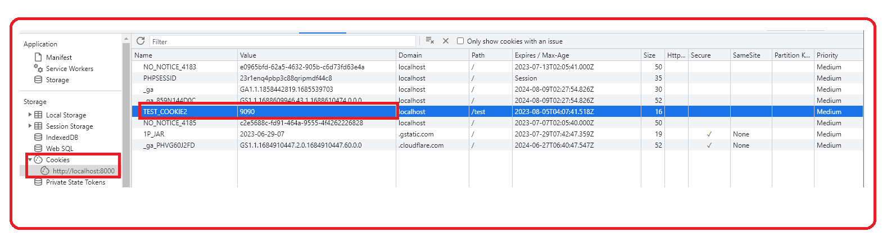
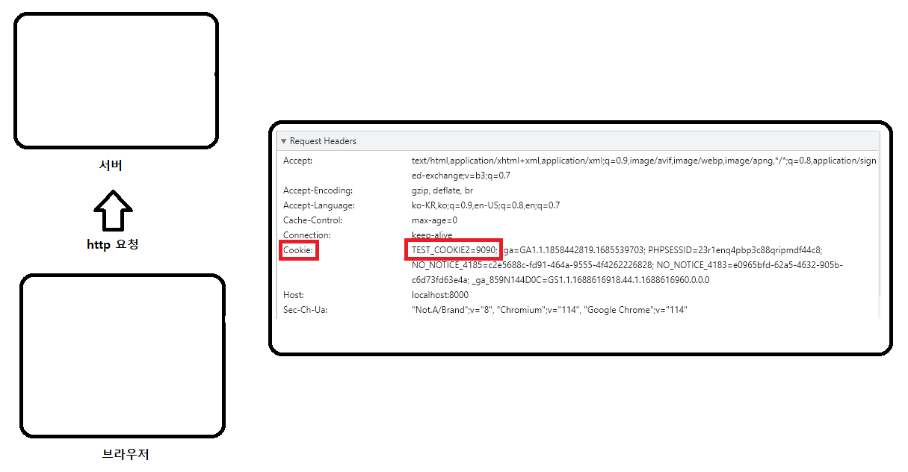
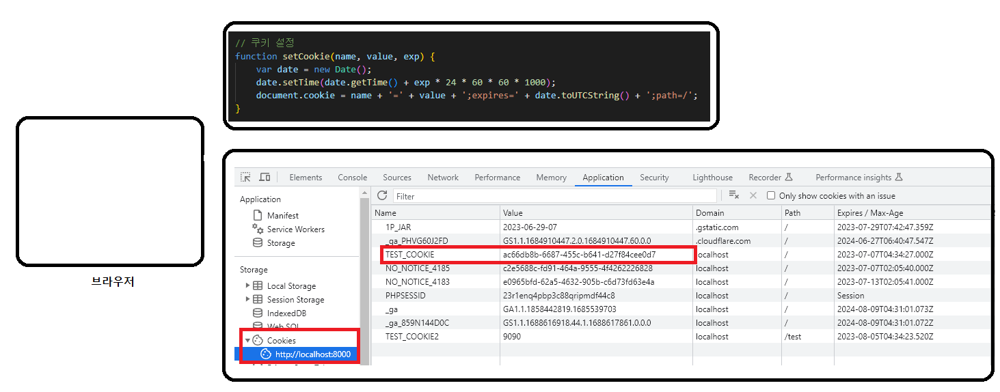
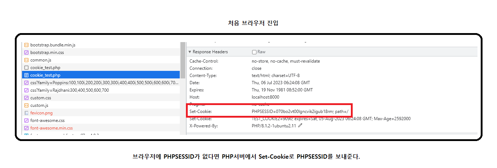
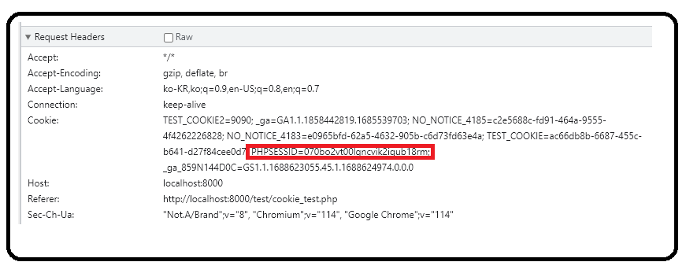
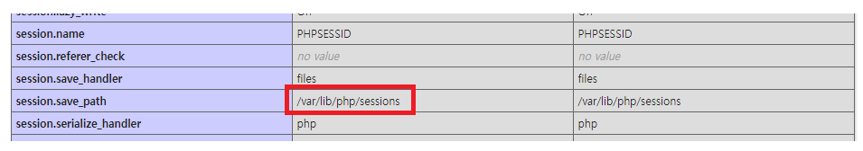
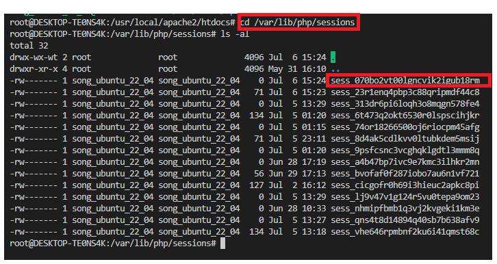

---
sidebar:
  nav: "docs"
title : 쿠키 및 세션
---

---

**쿠키**

HTTP 쿠키(웹 쿠키, 브라우저 쿠키)는 서버가 사용자의 웹 브라우저에 전송하는 작은 데이터 조각입니다.   
브라우저는 그 데이터 조각들을 저장해 놓았다가, 동일한 서버에 재 요청 시 저장된 데이터를 함께 전송합니다.  

---

**옵션**   

**1. Expires=`<date>`**
+ 쿠키의 최대 수명을 HTTP 날짜 타임스탬프로 표시합니다. 
+ 지정하지 않으면 쿠키는 세션 쿠키가 됩니다. 클라이언트가 종료되면 세션이 종료되고 그 후 세션 쿠키가 제거됩니다.   

**2. HttpOnly**
+ JavaScript가 Document.cookie 속성 등을 통해 쿠키에 액세스하는 것을 금지합니다.   

**3. Path=`<path-value>`**
+ 브라우저가 쿠키 헤더를 전송하기 위해 요청된 URL에 존재해야 하는 경로를 나타냅니다.    

---

**쿠키 라이프타임**   

1. 세션쿠키는 현재 세션이 끝날 때 삭제 됩니다.   
    
2. 영속적인 쿠키는 `Expires` 속성에 명시된 날짜에 삭제되거나, `Max-Age` 속성에 명시된 기간 이후에 삭제됩니다.   

---

**서버에서 쿠키 생성**   

서버에서 쿠키를 생성하게 되면 응답에 Set-Cookie를 포함해서 전송됩니다.

---

**브라우저에 만들어진 쿠키 확인**   

크롬 브라우저에서 application에서 현재 domain의 cookie를 확인

---

**브라우저 요청헤더에 쿠키포함**   

요청할때 cookie가 포함되어 전송됨.

---

**브라우저에서 쿠키 설정**   

브라우저에서 직접 쿠키를 설정할 수 있습니다.   
이후에 서버의 요청에는 쿠키가 포함되어 전송됩니다.

---

**세션**   

웹에서 세션(session)은 웹 서버와 웹 브라우저 간에 유지되는 상태 정보를 말합니다.    

PHP에서 세션정보를 어떻게 주고 받는지 봐보겠습니다   

---
**PHPSESSID 없으면 서버로부터 받게됨**

---

**그다음 서버로 요청을 보낼때, PHPSESSID 쿠키가 포함됨**   

---

**서버에서 SESSION 정보 저장 위치**   

PHP_INFO를 통해서 세션 저장위치 확인   

---

**세션정보파일 확인**   

   

실제 세션 ID에 대한 정보들이 저장된 파일을 확인   

정보들이 내부적으로 직렬화 되어 저장되게 된다.   

---

**PHP session_start()**    

session_start()은 GET 또는 POST 요청을 통해 전달되거나   
쿠키를 통해 전달된 세션 식별자를 기반으로   
세션을 생성하거나   
현재 세션을 재개합니다.  

session_start()가 호출되거나 세션이 자동 시작되면   
PHP는 the open and read session save handlers를 호출합니다.   

이 핸들러는 기본적으로 제공되는 내장 저장 핸들러이거나    
PHP 확장(예: SQLite 또는 Memcached)에 의해 제공되거나    
세션_set_save_handler()로 정의된 사용자 정의 핸들러일 수 있습니다.   
 
읽기 콜백은 기존 세션 데이터(특수 직렬화된 형식으로 저장됨)를 검색하고,    
읽기 콜백이 저장된 세션 데이터를 PHP 세션 처리로 다시 반환할 때 직렬화되지 않은 상태로   
$_SESSION 슈퍼글로벌을 자동으로 채우는 데 사용됩니다.   
