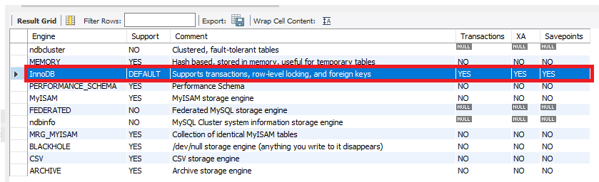

---
sidebar:
  nav: "docs"
title : MYSQL Engine
---

---

**InnoDB란**

InnoDB는 높은 안정성과 고성능이 균형을 이루는 범용 스토리지 엔진입니다.   
MySQL 5.7에서 InnoDB는 기본 MySQL 스토리지 엔진입니다.   
다른 기본 스토리지 엔진을 구성하지 않은 경우 ENGINE 절 없이 CREATE TABLE 문을 실행하면 InnoDB 테이블이 생성됩니다.   

---

**InnoDB 주요 이점**

+ 커밋, 롤백 및 충돌 복구 기능을 갖춘 트랜잭션과 함께 ACID 모델을 따릅니다.   

+ 행 수준 잠금과 Oracle 스타일의 일관된 읽기는 다중 사용자 동시성 및 성능을 향상시킵니다.    

+ InnoDB 테이블은 기본 키를 기반으로 쿼리를 최적화하기 위해 디스크에 데이터를 정렬합니다.   
각 InnoDB 테이블에는 클러스터된 인덱스라고 하는 기본 키 인덱스가 있어 기본 키 조회를 위한 I/O를 최소화하도록 데이터를 구성합니다.   

+ 데이터 무결성을 유지하기 위해 InnoDB는 외래 키 제약 조건을 지원합니다.   
외래 키를 사용하면 삽입, 업데이트 및 삭제가 관련 테이블 간에 불일치를 초래하지 않는지 확인합니다.   


---

**InnoDB가 기본 스토리지 엔진인지 확인**

```sql
mysql> SHOW ENGINES;
```




