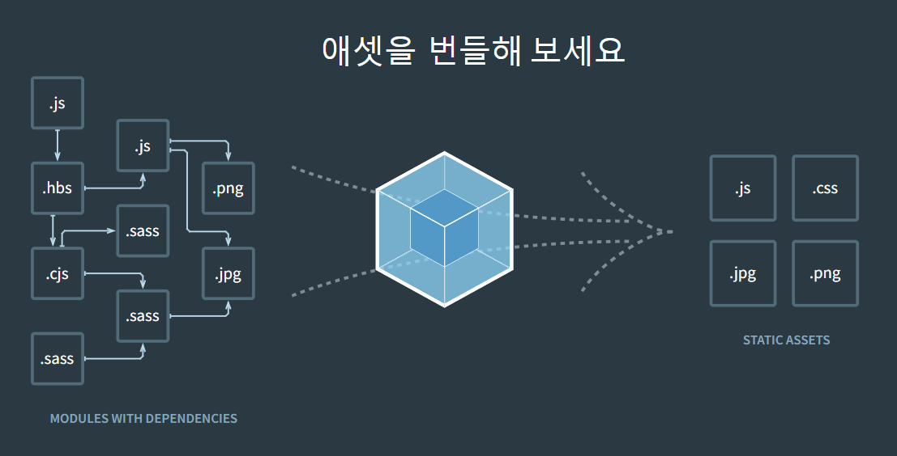

---
sidebar:
  nav: "docs"
title : 웹팩
---

---



**webpack**  
webpack은 모던 JavaScript 애플리케이션을 위한 정적 모듈 번들러 입니다.   
webpack이 애플리케이션을 처리할 때, 내부적으로는 프로젝트에 필요한 모든 모듈을 매핑하고   
하나 이상의 번들을 생성하는 디펜던시 그래프를 만듭니다.    

---

**Entry**   

엔트리 포인트는 webpack이 내부의 디펜던시 그래프 를 생성하기 위해 사용해야 하는 모듈입니다.   
Webpack은 엔트리 포인트가 (직간접적으로) 의존하는 다른 모듈과 라이브러리를 찾아냅니다.   
기본값은 ./src/index.js

---

**Output**   
output 속성은 생성된 번들을 내보낼 위치와 이 파일의 이름을 지정하는 방법을 webpack에 알려주는 역할을 합니다.   
기본 출력 파일의 경우에는 ./dist/main.js로 , 생성된 기타 파일의 경우에는 ./dist 폴더로 설정됩니다.    

---

**Loaders**   
webpack은 기본적으로 JavaScript와 JSON 파일만 이해합니다.   
로더를 사용하면 webpack이 다른 유형의 파일을 처리하거나, 그들을 유효한 모듈로 변환 하여 애플리케이션에서 사용하거나 디펜던시 그래프에 추가합니다.    

```s
...
module: {
    rules: [{ test: /\.txt$/, use: 'raw-loader' }],
},
...
```
```s
"이봐 webpack 컴파일러, require ()/import 문 내에서 '.txt' 파일로 확인되는 경로를 발견하면 번들에 추가하기 전에 raw-loader를 사용하여 변환해."
```

---

**Plugins**   
번들 생성 후 추가적인 작업을 수행하거나 최적화를 위한 기능을 제공합니다.   

```s
plugins: [new HtmlWebpackPlugin({ template: './src/index.html' })],
```
위의 예제에서 `html-webpack-plugin`은 생성된 모든 번들을 자동으로 삽입하여 애플리케이션용 HTML 파일을 생성합니다.   

---

**Mode**   
mode 파라미터를 development, production 또는 none으로 설정하면   
webpack에 내장된 환경별 최적화를 활성화 할 수 있습니다.   
기본값은 production 입니다.   

---

**webpack-dev-server**    
애플리케이션을 빠르게 개발하는 데 사용할 수 있습니다   

---

**webpack.config.js**   

```javascript
const path = require('path');

module.exports = {
  //...
  devServer: {
    static: {
      directory: path.join(__dirname, 'public'),
    },
    compress: true,
    port: 9000,
  },
};
```

---

**웹팩 개발 서버 시작**   
```s
npx webpack serve
```

---

**static.directory**   
서버에 콘텐츠를 제공할 위치를 알려줍니다.   
이것은 정적 파일을 제공하려는 경우에만 필요합니다.   

---
 
**static.publicPath**    
static.directory 콘텐츠를 제공할 URL을 서버에 알려주세요   

