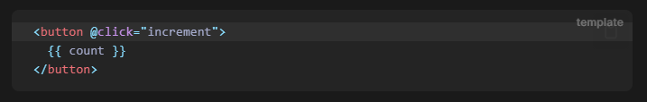
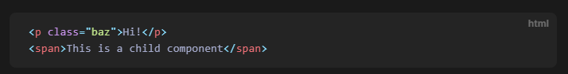
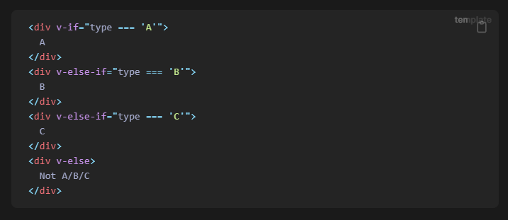
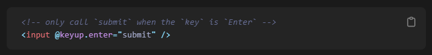
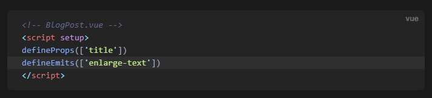

---
sidebar:
  nav: "docs"
title: Vue
---

---

**Vue란**  

Vue는 UI를 구축하기 위한 JavaScript 프레임워크입니다.  
표준 HTML, CSS 및 JavaScript를 기반으로 구축되며  
단순하거나 복잡한 UI를 효율적으로 개발하는 데 도움이 되는  
`declarative and component-based programming model` 을 제공합니다.

---

다음은 간단한 예시

```javascript
import { createApp, ref } from "vue";

createApp({
  setup() {
    return {
      count: ref(0),
    };
  },
}).mount("#app");
```

```javascript
<div id="app">
  <button @click="count++">
    Count is: {{ count }}
  </button>
</div>
```

위 예는 Vue의 2가지 핵심 기능을 보여줍니다.

1. Declarative Rendering : HTML에서 \{\{ \}\} 를 이용하여 javascript 값을 출력할 수 있음
2. Reactivity : javascript 값이 변경되면 자동으로 DOM이 변경될 수 있음

---   

**Single-File Components(SFC)**

SFC는 `\*.vue`파일 이라고도 합니다.  
이것을 통하여 Vue 컴포넌트를 작성합니다.  
SFC는 컴포넌트의 로직(JavaScript), 템플릿(HTML) 및 스타일(CSS)을 단일 파일에 캡슐화합니다.

*.vue 파일   
```javascript
<script setup>
import { ref } from "vue";
const count = ref(0);
</script>

<template>
  <button @click="count++">Count is: {{ count }}</button>
</template>

<style scoped>
button {
  font-weight: bold;
}
</style>
```

Vue 컴포넌트는 두 가지 API 스타일로 작성할 수 있습니다   
Options API 와 Composition API입니다.   

---   

**Options API**   

`data`, `methods`, `mounted` 등의 옵션 객체를 사용하여 컴포넌트의 로직을 정의할 수 있습니다.    
옵션으로 정의된 프로퍼티는 `this` 를 통해 접근 가능 합니다.   

```javascript
<script>
export default {
  // data()로부터 반환된 속성은 reactive한 상태가 되고
  // this를 통해 접근 가능합니다.
  data() {
    return {
      count: 0
    }
  },

  // Methods 변경가능한 function이고 update를 trigger합니다.
  // HTML template에 있는 이벤트 핸들러와 연결될 수 있습니다.
  methods: {
    increment() {
      this.count++
    }
  },

  // Lifecycle hooks
  // 이 함수는 컴포넌트가 마운트될 때 호출됩니다.
  mounted() {
    console.log(`The initial count is ${this.count}.`)
  }
}
</script>

<template>
  <button @click="increment">Count is: {{ count }}</button>
</template>
```

---   

**Composition API**   

Composition API는 일반적으로 `<script setup>`와 함께 사용됩니다.   
`setup` 속성은 Vue가  `compile-time transforms`을 수행하여 컴포지션 API를 사용할 수 있도록 하는 hint입니다.    

다음은 Composition API와 `<script setup>`를 사용한 예입니다.     
```javascript
<script setup>
import { ref, onMounted } from 'vue'

// reactive state
const count = ref(0)

// functions that mutate state and trigger updates
function increment() {
  count.value++
}

// lifecycle hooks
onMounted(() => {
  console.log(`The initial count is ${count.value}.`)
})
</script>

<template>
  <button @click="increment">Count is: {{ count }}</button>
</template>
```

---   

**Vite를 이용하여 vue시작해보기**   

```
npm init vue@latest
```
이 명령은 공식 Vue 프로젝트 생성 도구인 `create-vue`를 설치 및 실행합니다.   

```
cd <your-project-name>
npm install
npm run dev
```

권장 IDE 설정은 Visual Studio Code + Volar 확장입니다   

```
npm run build
```
프로젝트의 ./dist 디렉터리에 프로덕션에 사용할 수 있는 앱 빌드가 생성됩니다.    
프로덕션 배포 가이드를 확인하여 앱을 프로덕션에 배포하는 방법에 대해 자세히 알아보세요.  

**<i class="fa fa-info-circle" aria-hidden="true"></i> vite**   
Vite는 최신 웹 프로젝트에 더 빠르고 간결한 개발 환경을 제공하는 것을 목표로 하는 빌드 도구입니다.   
2가지 주요 기능으로 구성 됩니다.   
`   
native ES modules위에서 다양한 기능을 제공하는 개발 서버  
예를 들어 매우 빠른 핫 모듈 교체(HMR)가 가능합니다.   
`   
운영환경에서 최적화된 정적 에셋을 출력하도록 `Rollup`으로 Code를 번들로 묶는 빌드 명령어입니다.
{: .notice--info}

**<i class="fa fa-info-circle" aria-hidden="true"></i> HMR(Hot Module Replacement)**   
Vite는 기본 ESM을 통해 `HMR API`를 제공합니다.   
`   
HMR 기능이 있는 프레임워크는 API를 활용하여 페이지를 다시 로드하거나 애플리케이션 상태를 날려버리지 않고도 즉각적이고 정확한 업데이트를 제공할 수 있습니다.   
`   
Vite는  `Vue Single File Components ` 및 `React Fast Refresh`에 대한 `first-party HMR integrations`을 제공합니다.   
또한 @prefresh/vite를 통해 Preact에 대한 공식 통합이 가능합니다.
`   
`create-vite`를 통해 앱을 만들 때 이미 이러한 기능이 미리 구성되어 있으므로 수동으로 설정할 필요가 없습니다.    
{: .notice--info}

**<i class="fa fa-info-circle" aria-hidden="true"></i> @vitejs/plugin-react**   
React 프로젝트를 위한 기본 Vite 플러그인입니다.   
`   
개발에서 `Fast Refresh` 활성화   
`   
`automatic JSX runtime` 사용   
`   
커스텀 `Babel plugins/presets` 사용   
`   
작은 설치 크기   
{: .notice--info}

[@vitejs/plugin-react](https://github.com/vitejs/vite-plugin-react/tree/main/packages/plugin-react)

```javascript
// vite.config.js
import { defineConfig } from 'vite'
import react from '@vitejs/plugin-react'

export default defineConfig({
  plugins: [react()],
})
```

---   

**CDN을 이용하여 vue시작해보기**   

```javascript
<script src="https://unpkg.com/vue@3/dist/vue.global.js"></script>
```

CDN에서 Vue를 사용하는 경우 `build step`가 필요하지 않습니다.   
따라서 설정이 훨씬 간단해지며 정적 HTML을 향상시키거나 백엔드 프레임워크와 통합하는 데 적합합니다.   
하지만 단일 파일 컴포넌트(SFC) 구문은 사용할 수 없습니다.   

다음은 Global Build를 사용하는 전체 예제입니다   
```javascript
<script src="https://unpkg.com/vue@3/dist/vue.global.js"></script>

<div id="app">{{ message }}</div>

<script>
  const { createApp, ref } = Vue

  createApp({
    setup() {
      const message = ref('Hello vue!')
      return {
        message
      }
    }
  }).mount('#app')
</script>
```

---  

**ES Module Build를 이용하여 vue시작해보기**   

현재 대부분의 최신 브라우저는 `ES Modules`을 기본적으로 지원하므로   
이와 같은 `Native ES Modules`을 통해 CDN에서 Vue를 사용할 수 있습니다   

다음은 Global Build를 사용하는 전체 예제입니다   
```javascript
<div id="app">{{ message }}</div>

<script type="module">
  import { createApp, ref } from 'https://unpkg.com/vue@3/dist/vue.esm-browser.js'

  createApp({
    setup() {
      const message = ref('Hello Vue!')
      return {
        message
      }
    }
  }).mount('#app')
</script>
```

`<script type="module">`를 이용하고 있습니다.

1회성 서버 실행   
```s
npx serve
```

**<i class="fa fa-info-circle" aria-hidden="true"></i> npx serve**   
한번만 실행시킬 웹서버를 다운받아서 실행시키는 명령어 입니다.   
{: .notice--info}

**<i class="fa fa-info-circle" aria-hidden="true"></i> npx**   
execute npm package binaries의 줄임말.   
`      
npm을 사용하여 설치한 패키지를 실행할 때 일반적으로 `node [패키지명]` 과 같은 형식을 사용합니다.   
그러나 npx를 사용하면 패키지들을 설치하지 않고, 1회성으로 패키지를 바로 실행시킬 수 있습니다.   
{: .notice--info}

---  

**Bindings 속성**   

`v-bind` directive   
```html
<div v-bind:id="dynamicId"></div>
```
`v-bind directive`은 `element의 속성`과 `component의 속성`(dynamicId)를 연결 시킵니다.      
바인딩된 값이 널이거나 정의되지 않은 경우 속성이 렌더링된 요소에서 제거됩니다.   

**Shorthand**   

```html
<div :id="dynamicId"></div>
```

---  

**Dynamically Binding Multiple Attributes**   

여러 속성을 bind 시킬 경우 Object형식으로 연결시키면 됩니다.   

```javascript
const objectOfAttrs = {
  id: 'container',
  class: 'wrapper'
}
```

```html
<div v-bind="objectOfAttrs"></div>
```

JavaScript Expressions 사용도 가능 합니다.   


자바스크립트들은 현재 Component내에서 유효합니다.   

---

**Directives**   

Directives는 `v-` prefix를 가진 특별한 속성입니다.   
Vue는 수많은 `built-in directives`를 제공합니다.   
예를들어, `v-html` 과 `v-bind` 입니다.   

`Directives`의 역할은 표현식 값이 변경될 때, DOM에 업데이트를 반응적으로 적용하는 것입니다.    

아래는 seen의 존재여부에 따라 p 태그를 삭제할지 넣을지 선택하게 됩니다.   
```javascript
<p v-if="seen">Now you see me</p>
```

```javascript
<a v-on:click="doSomething"> ... </a>

<!-- shorthand -->
<a @click="doSomething"> ... </a>
```

`v-on` 으로 이벤트 리스너를 등록할 수 있습니다.   
`v-on` 은 `@`로 바꿀 수 있습니다.   

```javascript
<!--
Note that there are some constraints to the argument expression,
as explained in the "Dynamic Argument Value Constraints" and "Dynamic Argument Syntax Constraints" sections below.
-->
<a v-bind:[attributeName]="url"> ... </a>

<!-- shorthand -->
<a :[attributeName]="url"> ... </a>
```

```javascript
<a v-on:[eventName]="doSomething"> ... </a>

<!-- shorthand -->
<a @[eventName]="doSomething">
```

동적으로 속성과 이벤트 리스너를 등록할 수 있습니다.   

---

**Modifiers**   

`Directives`을 어떤 특별한 방식으로 바인딩해야 함을 나타냅니다.   

예를 들어 `.prevent` Modifier는 `v-on` Directive가 트리거된 이벤트에서 `event.preventDefault()`를 호출하도록 지시합니다   


---

**Declaring Reactive State**   

---

**ref()**   

Composition API에서, 반응형 상태를 선언할때 추천되는 방식은 `ref()` function을 사용하는 것입니다.   

```javascript
import { ref } from 'vue'

const count = ref(0)
```

ref()는 인수를 받고, `.value` 속성을 가진 ref 객체를 반환합니다.   

```javascript
const count = ref(0)

console.log(count) // { value: 0 }
console.log(count.value) // 0

count.value++
console.log(count.value) // 1
```

Component의 Template에서 Ref를 사용하기위해서   
Component의 `setup()` function에서 Ref를 선언하고 반환합니다   

```javascript
import { ref } from 'vue'

export default {
  // `setup` is a special hook dedicated for the Composition API.
  setup() {
    const count = ref(0)

    // expose the ref to the template
    return {
      count
    }
  }
}
```


Template에서 Ref를 사용할 때 `.value`를 추가할 필요가 없습니다.   
편의를 위해 Template 내에서 Wrapping이 자동으로 해제됩니다.   


Expose된 메소드는 이벤트 핸들러로 사용될 수 있습니다.   



---

**\<script setup\>**   

`setup()`을 통해 상태와 메서드를 수동으로 노출하는 것은 장황할 수 있습니다.    
다행히도 단일 파일 컴포넌트(SFC)를 사용하면 이 문제를 피할 수 있습니다.   
`<script setup>`으로 사용법을 단순화할 수 있습니다    


중첩된 객체나 배열을 변경해도 변경 사항이 감지할 수 있습니다.   


```javascript
import { ref } from 'vue'

const obj = ref({
  nested: { count: 0 },
  arr: ['foo', 'bar']
})

function mutateDeeply() {
  // these will work as expected.
  obj.value.nested.count++
  obj.value.arr.push('baz')
}
```

`Non-primitive values` 은 아래에서 설명하는 `reactive()`를 통해 반응형 프록시로 변환됩니다.   

`reactive state`를 변경하면 DOM은 자동적으로 업데이트 됩니다.   
하지만 Vue 업데이트는 동기적이지 않기 때문에, DOM 업데이트 완료될 때까지 기다리려면 `nextTick()`을 사용해야 합니다.   

```javascript
import { nextTick } from 'vue'

async function increment() {
  count.value++
  await nextTick()
  // Now the DOM is updated
}
```

---

**reactive()**   

`reactive state`를 만드는 또 다른 방법은 `reactive()`를 사용하는 것입니다.   

특수 객체에서 내부 값을 감싸는 `Ref`와 달리 `reactive()`는 객체 자체를 반응형으로 만듭니다   

```javascript
import { reactive } from 'vue'

const state = reactive({ count: 0 })
```

```javascript
<button @click="state.count++">
  {{ state.count }}
</button>
```

반응형 객체는 JavaScript 프록시이며 일반 객체와 똑같이 동작합니다.   
차이점은 Vue가 반응성 추적 및 트리거를 위해 반응형 객체의 모든 프로퍼티에 대한 접근과 변형을 가로챌 수 있다는 점입니다.    

`reactive()`에서 반환되는 값은 원래 객체의 프록시로, 원래 객체와 같지 않다는 점에 유의해야 합니다    

```javascript
const raw = {}
const proxy = reactive(raw)

// proxy is NOT equal to the original.
console.log(proxy === raw) // false
```

프록시만 반응형이므로 원본 객체를 변경해도 업데이트가 트리거되지 않습니다.    
따라서 Vue의 반응형 시스템으로 작업할 때 가장 좋은 방법은 상태의 프록시 버전만 사용하는 것입니다.    

프록시에 대한 일관된 액세스를 보장하기 위해 동일한 객체에서 `reactive()`를 호출하면 항상 동일한 프록시가 반환되고,    
기존 프록시에서` reactive()`를 호출하면 동일한 프록시도 반환됩니다    

```javascript
// calling reactive() on the same object returns the same proxy
console.log(reactive(raw) === proxy) // true

// calling reactive() on a proxy returns itself
console.log(reactive(proxy) === proxy) // true
```

이 규칙은 중첩된 객체에도 적용됩니다. 깊은 반응성으로 인해 반응형 객체 내부에 중첩된 객체도 프록시입니다   

```javascript
const proxy = reactive({})

const raw = {}
proxy.nested = raw

console.log(proxy.nested === raw) // false
```

---

**reactive() 제한사항**   

1. 제한된 값 유형: 객체 유형(객체, 배열, Map 및 Set와 같은 Collection 유형)에 대해서만 작동합니다.   
문자열, 숫자 또는 부울과 같은 기본 유형은 보유할 수 없습니다.   

2. 전체 객체를 대체할 수 없음   
Vue의 반응성 추적은 속성 액세스를 통해 작동하므로 반응성 객체에 대한 참조를 항상 동일하게 유지해야 합니다.   
즉, 첫 번째 참조에 대한 반응성 연결이 끊어지기 때문에 반응형 객체를 쉽게 "교체"할 수 없습니다     


3. `Not destructure-friendly`: 반응형 객체의 프로퍼티를 로컬 변수로 `destructure`하거나 해당 프로퍼티를 함수에 전달할 때 반응성 연결이 끊어집니다    

```javascript
const state = reactive({ count: 0 })

// destructure할때 count는 state.count로부터 연결이 해제 됩니다.
let { count } = state
// 원본 state에는 영향을 미치지 않습니다.
count++

// 해당 function은 일반 숫자를 받을 뿐입니다.
// 더 이상 state.count에 대한 변화를 추적하지 않습니다.
// 우리는 반응성을 유지하기 위해서는 Object 자체를 전달해야 합니다.
callSomeFunction(state.count)
```

이러한 제한 사항으로 인해 반응형 상태를 선언하는 기본 API로 ref()를 사용하는 것이 좋습니다.    

---

**Binding to Objects**   

`class`를 동적으로 `toggle`하기 위해 `Object`를 `:class`(`v-bind:class`)로 전달할 수 있습니다    


`:class`는 일반 `class`와 함께 공존할 수 있습니다.   


위 내용은 아래와 같이 렌더링 됩니다.   


아래처럼 인라인 형태가 아니라 따로 변수로 빼도 괜찮습니다.   


`computed` 속성을 사용할 수도 있습니다.    


---

**Binding to Arrays**   

`class`를 `array`와 바인딩하여 `class list`을 적용할 수 있습니다   


위 소스는 아래 그림처럼 렌더링 될 것 입니다.   


`class`를 `toggle`하기 위해서 3항 연사자를 이용할 수 있습니다.   


이렇게 하면 `errorClass`가 항상 적용이 되고, `activeClass`는 isActive가 `true`일 때만 적용됩니다.   

그러나 조건부 클래스가 여러 개 있는 경우 이 방법은 다소 장황할 수 있습니다.    
그렇기 때문에 배열 구문 안에 객체 구문을 사용할 수도 있습니다    


**with components**   

`single root element`가 있는 컴포넌트에서 `class` 속성을 사용하면   
해당 `class`가 컴포넌트의 `root element`에 추가되고 이미 있는 기존 `class`와 병합됩니다.

MyComponent 아래에 있는 자식 엘리먼트 (`root element`)


MyComponent에 class 몇개 추가   


그결과 아래 처럼 렌더링 됩니다.   


컴포넌트에 여러 `root element`가 있는 경우 이 `class`를 수신할 엘리먼트를 정의해야 합니다.    
작업은 `$attrs` 컴포넌트 속성을 사용하여 수행할 수 있습니다    


아래처럼 렌더링 될 것 입니다.   



---

**Binding Inline Styles**    

---

**Binding to Objects**   

`:style`은 `JavaScript object values`로 바인딩을 지원합니다.   
HTML 요소의 `style` 프로퍼티에 해당합니다.   


`camelCase` 키가 권장되지만, `kebab-cased CSS` 키(실제 CSS에서 사용되는 방식에 해당)도 지원합니다.    


---

**Binding to Arrays**   

`:style`을 `array of multiple style objects`에 바인딩할 수 있습니다.    
이러한 객체는 병합되어 동일한 요소에 적용됩니다    


---

**Conditional Rendering**   

---

**v-if**   

` directive v-if`는 조건부로 블록을 렌더링하는 데 사용됩니다.   
`directive's expression`이 `true`을 반환하는 경우에만 블록이 렌더링됩니다.    


---

**v-else**   

`v-else`요소는 `v-if` 또는 `v-else-if` 요소 바로 뒤에 와야 하며, 그렇지 않으면 인식되지 않습니다.   


---

**v-else-if**   



---

**v-if on template**    
`v-if`는 `directive`이므로 단일 요소에 첨부해야 합니다.   
하지만 둘 이상의 요소를 토글하려면 어떻게 해야 할까요?   
이 경우 보이지 않는 래퍼 역할을 하는 `<template>` 요소에 `v-if`를 사용할 수 있습니다.   
최종 렌더링 결과에는 `<template>` 요소가 포함되지 않습니다.    

**v-show**   
조건부로 요소를 표시하는 또 다른 옵션은 `v-show` `directive`입니다. 사용법은 거의 동일합니다    


`v-if`와의 차이점은 `v-show`가 있는 요소는 항상 렌더링되어 DOM에 남아 있지만,   
`v-show`는 요소의 표시 CSS 속성만 토글한다는 점입니다.    

`v-show`는 `<template>` 요소를 지원하지 않으며 `v-else`와도 작동하지 않습니다.     

---

**v-if 와 v-for**   

동일한 요소에` v-if`와 `v-for`가 모두 사용되는 경우 `v-if`가 먼저 평가됩니다.    

---

**List Rendering**   

---

**v-for**   

`v-for Directive`를 사용하여 배열을 기반으로 항목 목록을 렌더링할 수 있습니다.   
`v-for Directive`를 사용하려면 `item in items` 형식의 특수 구문이 필요한데,   
여기서 `items`은 소스 데이터 배열이고 `item`은 반복되는 배열 요소의 별칭입니다.     


`v-for` 범위 내에서 템플릿 표현식은 모든 상위 범위 속성에 액세스할 수 있습니다.   
또한 `v-for`는 현재 항목의 인덱스에 대한 두 번째 별칭(선택 사항)도 지원합니다.    


`function arguments`를 `destructuring`하기 위해서   
`v-for item alias` 에 `destructuring`를 사용할 수 있습니다.     


중첩된 `v-for`의 경우 범위 지정도 중첩된 함수와 유사하게 작동합니다.   
각` v-for` 범위는 상위 범위에 액세스할 수 있습니다.    


또한 `in` 대신 구분 기호로 `of`를 사용할 수 있습니다.   
이것은 JavaScript의 `iterators` 문법에 더 가깝습니다.    

---

**v-for with an Object**   

`v-for`를 사용하여 객체의 속성을 반복할 수도 있습니다.   
반복 순서는 객체에서 `Object.keys()`를 호출한 결과에 따라 결정됩니다.   


속성 이름에한 두 번째 별칭(`key`)을 입력할 수도 있습니다.    


`index`도 가능 합니다.   


---

**v-for with a Range**   

`v-for`는 정수를 취할 수도 있습니다.   
이 경우 `1...n`의 범위를 기준으로 템플릿을 해당 횟수만큼 반복합니다.   


여기서 n은 0이 아닌 초기값 1로 시작합니다.     

---

**v-for on template**   

템플릿 `v-if`와 유사하게, `v-for`와 함께 `<template>` 태그를 사용하여   
여러 요소의 블록을 렌더링할 수도 있습니다.    


---

**v-for with v-if**   

`v-for`와 `v-if`가 동일한 노드에 있을 경우,    
`v-if`가 `v-for`보다 우선순위가 높습니다.    
즉, `v-if` 조건은 `v-for`의 범위에 있는 변수에 액세스할 수 없습니다.   


위 문제는 아래처럼 `v-for` 아래에 `v-if`를 두면 됩니다.   


**Maintaining State with key**   

Vue가 `v-for`로 렌더링된 요소 목록을 업데이트할 때 기본적으로 `in-place patch` 전략을 사용합니다.   
데이터 항목의 순서가 변경된 경우 항목의 순서와 일치하도록 DOM 요소를 이동하는 대신    
Vue는 각 요소를 `in-place`에 `patch`하고 해당 특정 인덱스에서 렌더링해야 하는 내용을 반영하는지 확인합니다.   

이 기본 모드는 효율적이지만 목록 렌더링 출력이 하위 컴포넌트 상태나 임시 DOM 상태(예: 양식 입력 값)에 의존하지 않는 경우에만 적합합니다.

Vue가 각 노드의 ID를 추적하여 기존 요소를 재사용하고 순서를 변경할 수 있도록 힌트를 제공하려면   
각 항목에 고유한 `Key` 속성을 제공해야 합니다    


**v-for with a Component**   

일반 요소와 마찬가지로 컴포넌트에 직접 `v-for`를 사용할 수 있습니다(``key``를 제공하는 것을 잊지 마세요)    


하지만 컴포넌트에는 고유한 범위가 있기 때문에 컴포넌트에 자동으로 데이터가 전달되지는 않습니다.   
반복된 데이터를 컴포넌트에 전달하려면 프로퍼티도 사용해야 합니다   


컴포넌트에 항목을 자동으로 삽입하지 않는 이유는 그렇게 하면 컴포넌트가 `v-for`의 작동 방식과 긴밀하게 결합되기 때문입니다. 데이터의 출처를 명시하면 다른 상황에서도 컴포넌트를 재사용할 수 있습니다.   

---

**Array Change Detection**   

---

**Mutation Methods**    

Vue는 반응형 배열의 `Mutation` 메서드가 호출되는 시점을 감지하고 필요한 업데이트를 트리거할 수 있습니다.   
이러한 `Mutation` 메서드는 다음과 같습니다   


**Replacing an Array**   

이름에서 알 수 있듯이 `Mutation` 메서드는 호출된 원래 배열을 변경 시킵니다.   
이에 비해 `filter()`, `concat()`, `slice()`와 같이 원래 배열을 변경하지 않고 항상 새 배열을 반환하는   
`non-mutating` 메서드도 있습니다.    
`non-mutating` 메서드로 작업할 때는 기존 배열을 새 배열로 대체해야 합니다    


이렇게 하면 Vue가 기존 DOM을 버리고 전체 목록을 다시 렌더링할 것이라고 생각할 수 있지만 다행히도 그렇지 않습니다.   
Vue는 DOM 요소 재사용을 극대화하기 위해 몇 가지 스마트한 `heuristics`을 구현하므로 배열을 겹치는 객체가 포함된 다른 배열로 교체하는 것은 매우 효율적인 작업입니다.

**<i class="fa fa-info-circle" aria-hidden="true"></i> 휴리스틱(heuristics)**   
휴리스틱(heuristics)은 한국어로는 '경험적 규칙' 또는 '추론 방법'으로 번역될 수 있습니다.   
이는 복잡한 문제를 해결하기 위해 일반적으로 사용되는 규칙 또는 방법론을 가리킵니다.   
휴리스틱은 문제 해결에 대한 근사적인 해결책을 제시하거나, 탐색 과정에서 결정을 내리는 데 도움이 될 수 있습니다.   
`
휴리스틱은 일반적으로 문제의 복잡성을 줄이고 문제 공간을 탐색하는 데 사용됩니다.   
이러한 방법은 직관적이고 경험적이기 때문에 효율적인 해결책을 제시할 수 있지만, 항상 최적의 해결책을 보장하지는 않습니다.   때문에 휴리스틱은 근사적인 해결 방법으로 활용되며, 특정 상황에 따라 결과가 다를 수 있습니다.   
{: .notice--info}

---

**Displaying Filtered/Sorted Results**    

때로는 원본 데이터를 실제로 변경하거나 재설정하지 않고 배열의 필터링 또는 정렬된 버전을 표시하고 싶을 때가 있습니다.   
이 경우 필터링되거나 정렬된 배열을 반환하는 `computed` 프로퍼티를 만들 수 있습니다.    


`computed` 프로퍼티를 사용할 수 없는 상황(예: 중첩된 `v-for` 루프 내부)에서는 `method`를 사용할 수 있습니다    


`computed` 프로퍼티에서 `reverse()` 및 `sort()`를 사용할 때 주의하세요!   
이 두 메서드는 원래 배열을 변경하므로 `computed getter` 에서는 피해야 합니다.    
이러한 메서드를 호출하기 전에 원본 배열의 복사본을 만드세요    


---

**Event Handling**   

---

**Listening to Events**   

일반적으로 `@` 기호로 줄여서 사용하는 `v-on Directive`을 사용하여 DOM 이벤트를 수신하고 트리거될 때 일부 JavaScript를 실행할 수 있습니다.    
사용법은 `v-on:click="핸들러"` 또는 `@click="핸들러"`와 함께 사용할 수 있습니다.     

핸들러 값은 다음 중 하나가 될 수 있습니다:

1. Inline 핸들러: 이벤트가 트리거될 때 실행될 인라인 자바스크립트(native `onclick` attribute와 유사함).

2. Mehtod 핸들러: 컴포넌트에 정의된 메서드를 가리키는 속성 이름 또는 경로입니다.

---

**Inline Handlers**   

인라인 핸들러는 일반적으로 간단한 경우에 사용됩니다    


---

**Method Handlers**   

하지만 많은 이벤트 핸들러의 로직은 더 복잡하며 인라인 핸들러에서는 실현 불가능할 수 있습니다.   
그렇기 때문에 `v-on`은 호출하려는 컴포넌트 메서드의 이름이나 경로를 받을 수도 있습니다.


메서드 핸들러는 이를 트리거하는 네이티브 DOM 이벤트 객체를 자동으로 수신합니다.    

---

**Method VS Inline 탐지**
템플릿 컴파일러는 `v-on` 값 문자열이 유효한 JavaScript 식별자 또는 속성 액세스 경로인지 확인하여 메서드 핸들러를 감지합니다.    
예를 들어, foo, foo.bar 및 foo['bar']는 메서드 핸들러로 처리되는 반면,   
foo() 및 count++는 인라인 핸들러로 처리됩니다.

---

**Calling Methods in Inline Handlers**   

메서드 이름에 직접 바인딩하는 대신 인라인 핸들러에서 메서드를 호출할 수도 있습니다.    
이렇게 하면 네이티브 이벤트 대신 메서드 커스텀 인수를 전달할 수 있습니다    


---

**Accessing Event Argument in Inline Handlers**    

때로는 인라인 핸들러에서 원본 DOM 이벤트에 액세스해야 할 때도 있습니다.   
특수 $event 변수를 사용하여 메서드에 전달하거나 인라인 화살표 함수를 사용할 수 있습니다    


---

**Event Modifiers**    

이벤트 핸들러 내부에서 `event.preventDefault()` 또는 `event.stopPropagation()`을 호출하는 것은 매우 일반적인 요구입니다.      
메서드 내부에서 이 작업을 쉽게 수행할 수 있지만, 메서드가 DOM 이벤트 세부 정보를 다루기보다는 순전히 데이터 로직에 관한 것이라면 더 좋을 것입니다.    

이 문제를 해결하기 위해 Vue는 `v-on`에 대한 이벤트 `Modifiers`를 제공합니다.   
`Modifiers`는 `.`으로 표시되는 `Directive` 후미부라는 것을 기억하세요.    


수정자를 사용할 때는 관련 코드가 동일한 순서로 생성되므로 순서가 중요합니다.    
따라서 `@click.prevent.self`를 사용하면 요소 자체와 하위 요소에 대한 클릭의 기본 동작을 방지하고,     
`@click.self.prevent`를 사용하면 요소 자체에 대한 클릭의 기본 동작만 방지할 수 있습니다.     

---

**Key Modifiers**    




**Key Aliases**   


**System Modifier Keys**   


**Mouse Button Modifiers**   


---

**Form Input Bindings**    

---

프론트엔드에서 양식을 처리할 때 양식 입력 요소의 상태를 JavaScript의 해당 상태와 동기화해야 하는 경우가 많습니다.    
값 바인딩을 수동으로 연결하고 이벤트 리스너를 변경하는 것은 번거로울 수 있습니다     


`v-model` 지시문을 사용하면 위의 작업을 단순화할 수 있습니다.    


또한 `v-model`은 다양한 유형의 입력, `<textarea>` 및 `<select>` 요소에 사용할 수 있습니다.   
사용되는 요소에 따라 다른 DOM 속성 및 이벤트 쌍으로 자동 확장됩니다.   

텍스트 유형이 있는 `<input>`과 `<textarea>` 요소는 `value` 프로퍼티와 `input` 이벤트를 사용합니다.    
`<input type="checkbox">` 및 `<input type="radio">`는 `checked`  프로퍼티와 `change` 이벤트를 사용합니다.   
`<select>`은 `value`을 사용하고 `change`을 이벤트로 사용합니다.    

`v-model`은 양식 요소에서 발견되는 초기 `value`, `selected` 또는 `checked` 속성을 무시합니다.   
항상 현재 바인딩된 자바스크립트 상태를 진실의 소스로 취급합니다.    
반응성 API를 사용하여 자바스크립트 측에서 초기값을 선언해야 합니다.    

---

**Basic Usage**   

---

**Text**   


중국어, 일본어, 한국어 등 `IME`가 필요한 언어의 경우 `IME` 구성 중에 `v-model`이 업데이트되지 않는 것을 알 수 있습니다.      이러한 업데이트에도 응답하려면 `v-model`을 사용하는 대신 자체 입력 이벤트 리스너와 값 바인딩을 사용하세요.    

---

**Multiline text**   


`textarea` 안에 `interpolation`를 사용하지 말고, `v-model`을 사용헤야 합니다.    


---

**Checkbox**    


---

**Radio**    


---

**Select**   


`v-model` 표현식의 초기 값이 옵션 중 어느 것과도 일치하지 않으면 `<select>` 요소가 `unselected` 상태로 렌더링됩니다.   iOS에서는 이 경우 변경 이벤트가 발생하지 않으므로 사용자가 첫 번째 항목을 선택할 수 없게 됩니다.    
따라서 위의 예시에서와 같이 `disabled` 옵션에 빈 값을 제공하는 것이 좋습니다.    


Multiple select (bound to array)    


선택 옵션은 v-for를 사용하여 동적으로 렌더링할 수 있습니다    


---

**Value Bindings**    

---

`radio`, `checkbox` 및 `select options`의 경우   
일반적으로 `v-model` 바인딩 값은 정적 문자열(또는 체크박스의 경우 `boolean`)입니다    


그러나 때로는 현재 활성 인스턴스의 동적 프로퍼티에 값을 바인딩하고 싶을 수도 있습니다.   
이를 위해 `v-bind`를 사용할 수 있습니다.   
또한 `v-bind`를 사용하면 입력 값을 문자열이 아닌 값에 바인딩할 수 있습니다.   

---

**Checkbox**    


`true-value` 및 `false-value`는 `v-model`에서만 작동하는 Vue 전용 속성입니다.   
여기서 토글 속성의 값은 확인란을 선택하면 `yes`로 설정되고, 선택하지 않으면 `no`로 설정됩니다.    
`v-bind`를 사용하여 동적 값에 바인딩할 수도 있습니다.


---

**Radio**   


`pick`은 위의 라디오 `radio`을 선택하면 `first` 값으로 설정되고, 아래의 `radio`을 선택하면 `second` 값으로 설정됩니다.    

---

**Select Options**   


`v-model`은 문자열이 아닌 값의 바인딩도 지원합니다!    
위의 예에서 이 옵션을 선택하면 `{ number: 123 }`의 객체 리터럴 값으로 `selected`이 설정됩니다.    

---

**Modifiers**    

---

**.lazy**    

기본적으로 `v-model`은 각 입력 이벤트 후에 입력을 데이터와 동기화합니다(위에서 설명한 IME 구성은 제외).   
`lazy` 수정자를 추가하여 변경 이벤트 후에 동기화하도록 할 수 있습니다:


**.number**    

사용자 입력을 숫자로 자동 변경 하려면 `v-model` 관리 입력에 `number` 수정자를 추가하면 됩니다    


**.trim**    

사용자 입력의 공백이 자동으로 잘리도록 하려면 `v-model` 관리 입력에 `trim `수정자를 추가하면 됩니다    

---

**Lifecycle Hooks**   

각 Vue 컴포넌트 인스턴스는 생성될 때 일련의 초기화 단계를 거치는데,    
예를 들어 데이터 관찰을 설정하고, 템플릿을 컴파일하고, 인스턴스를 DOM에 마운트하고, 데이터가 변경되면 DOM을 업데이트해야 합니다.   
이 과정에서 `Lifecycle Hooks`라는 함수를 실행하여 사용자가 특정 단계에서 자신만의 코드를 추가할 수 있는 기회도 제공합니다.   

---

**Registering Lifecycle Hooks**   

예를 들어, 컴포넌트가 초기 렌더링을 완료하고 DOM 노드를 생성한 후 코드를 실행하는 데 `onMounted` 훅을 사용할 수 있습니다.    


인스턴스 수명 주기의 여러 단계에서 호출되는 다른 후크도 있으며,   
가장 일반적으로 사용되는 후크는 `onMounted`, `onUpdated` 및 `onUnmounted`입니다.    

`onMounted`를 호출할 때 Vue는 등록된 콜백 함수를 현재 활성 컴포넌트 인스턴스와 자동으로 연결합니다.    
이를 위해서는 컴포넌트 설정 중에 이러한 훅을 동기적으로 등록해야 합니다.    
예를 들어 이렇게 하지 마십시오    


---

**Lifecycle Diagram**   


---

**Watchers**   

`Computed` 프로퍼티를 사용하면 파생된 값을 선언적으로 계산할 수 있습니다.   
그러나 상태 변경에 대한 반응으로 '부작용'을 수행해야 하는 경우가 있습니다   
(예: DOM을 변경하거나 비동기 작업의 결과에 따라 다른 상태를 변경하는 경우).   

`Composition API`를 사용하면 `watch` 함수를 사용하여 반응형 상태가 변경될 때마다 콜백을 트리거할 수 있습니다    


`watch`의 첫 번째 인수는 `ref`(`computed ref` 포함), `reactive object`, `getter function` 또는 `array` 등   
다양한 유형이 될 수 있습니다.    

---

**Watch Source Types**   

`watch`의 첫 번째 인수는 참조(계산된 참조 포함), 반응형 객체, 게터 함수 또는 여러 소스의 배열 등 다양한 유형의 반응형 '소스'일 수 있습니다:


이와 같이 반응형 객체의 프로퍼티를 볼 수 없다는 점에 유의하세요:


대신 getter를 이용하세요.   


---

**Deep Watchers**   

반응형 객체에서 `watch()`를 직접 호출하면 암시적으로 심층 감시자가 생성되며, 콜백은 중첩된 모든 변이에서 트리거됩니다    


반응형 객체를 반환하는 게터와 구별해야 합니다.    
후자의 경우 콜백은 게터가 다른 객체를 반환하는 경우에만 실행됩니다    


그러나 명시적으로 `Deep` 옵션을 사용하여 두 번째 케이스를 `Deep` 워처로 강제 설정할 수 있습니다   


---

**Template Ref**   

Vue의 선언적 렌더링 모델은 대부분의 직접 DOM 연산을 추상화하지만, 기본 DOM 요소에 직접 액세스해야 하는 경우가 여전히 있을 수 있습니다.    이를 위해 특수 `ref` 속성을 사용할 수 있습니다    


`ref`는 `v-for` 챕터에서 설명한 `Key` 어트리뷰트와 유사한 특수 어트리뷰트입니다.   
이 속성을 사용하면 마운트된 후 특정 DOM 엘리먼트나 하위 컴포넌트 인스턴스에 대한 직접 참조를 얻을 수 있습니다.   
예를 들어 컴포넌트 마운트에 프로그래밍 방식으로 입력을 집중시키거나 요소에 타사 라이브러리를 초기화하려는 경우에 유용할 수 있습니다.   

---

**Accessing the Refs**   

`Composition API`로 참조를 얻으려면 같은 이름의 참조를 선언해야 합니다:


컴포넌트가 마운트된 후에만 `ref`에 액세스할 수 있다는 점에 유의하세요.   
템플릿 표현식에서 입력에 액세스하려고 하면 첫 번째 렌더링에서 null이 됩니다.   
첫 번째 렌더링이 끝날 때까지 요소가 존재하지 않기 때문입니다!    

템플릿 `ref`의 변경 사항을 확인하려는 경우, `ref`에 null 값이 있는 경우를 고려해야 합니다     

---

**Refs inside v-for**   

`v-for` 내부에서 `ref`를 사용하는 경우, 해당 `ref`에는 마운트 후 엘리먼트로 채워질 Array 값이 포함되어야 합니다:


---

**Components Basics**    

컴포넌트를 사용하면 UI를 독립적이고 재사용 가능한 조각으로 분할하고   
각 조각을 독립적으로 생각할 수 있습니다.    
앱은 중첩된 컴포넌트의 트리로 구성되는 것이 일반적입니다    


**Defining a Component**   

빌드 단계를 사용할 때 일반적으로 `Single-File Component` (`SFC`)라고 하는 .vue 확장자를 사용하여   
전용 파일에 각 Vue 컴포넌트를 정의합니다   


빌드 단계를 사용하지 않는 경우 Vue 컴포넌트는 Vue 관련 옵션이 포함된 일반 JavaScript 객체로 정의할 수 있습니다    


**Using a Component**   

자식 컴포넌트를 사용하려면 부모 컴포넌트에서 컴포넌트를 임포트해야 합니다.    
카운터 컴포넌트를 `ButtonCounter.vue`라는 파일 안에 배치했다고 가정하면, 이 컴포넌트는 파일의 기본 내보내기로 노출됩니다   


---

**Passing Props**   

블로그를 구축하는 경우 블로그 게시물을 나타내는 컴포넌트가 필요할 수 있습니다.   
모든 블로그 게시물이 동일한 시각적 레이아웃을 공유하되 콘텐츠는 서로 다르기를 원합니다.   
이러한 컴포넌트는 표시하려는 특정 게시물의 제목 및 콘텐츠와 같은 데이터를 전달할 수 없다면 유용하지 않습니다.   
이때 `Props`이 필요합니다.   

`Props`은 컴포넌트에 등록할 수 있는 사용자 정의 속성입니다.    
블로그 게시물 컴포넌트에 제목을 전달하려면 이 컴포넌트가 허용하는 `Props` 목록에서 `defineProps` 매크로를 사용하여 제목을 선언해야 합니다   


`defineProps`는 컴파일 타임 매크로로 `<script setup>` 내에서만 사용할 수 있으며 명시적으로 가져올 필요가 없습니다.   
`Declared props`는 템플릿에 자동으로 노출되며, 필요한 경우 자바스크립트에서 액세스할 수 있도록 컴포넌트에 전달된 모든 프로퍼티가 포함된 객체를 반환합니다    


`<script setup>`을 사용하지 않는 경우 `props` 옵션을 사용하여 `props`를 선언해야 하며,   
`props` 객체가 `setup()`에 첫 번째 인수로 전달됩니다    


컴포넌트에는 원하는 만큼의 `prop`를 가질 수 있으며, 기본적으로 모든 값을 `prop`에 전달할 수 있습니다.   

`prop`이 등록되면 다음과 같이 `prop`에 데이터를 커스텀 어트리뷰트로 전달할 수 있습니다    


하지만 일반적인 앱에서는 상위 컴포넌트에 여러 개의 게시물이 있을 수 있습니다     


그런 다음 각 컴포넌트에 대해 `v-for`를 사용하여 렌더링하고 싶습니다   


동적 `Props` 값을 전달하기 위해 `v-bind`가 어떻게 사용되는지 주목하세요.   
이 기능은 렌더링할 정확한 콘텐츠를 미리 알 수 없을 때 특히 유용합니다.    

---

**Listening to Events**   

<BlogPost> 컴포넌트를 개발할 때 일부 기능은 상위 컴포넌트와 다시 통신해야 할 수 있습니다. 예를 들어, 블로그 게시물의 텍스트를 확대하는 접근성 기능을 포함하되 페이지의 나머지 부분은 기본 크기로 유지하기로 결정할 수 있습니다.

상위 컴포넌트에서 postFontSize 참조를 추가하여 이 기능을 지원할 수 있습니다:


템플릿에서 모든 블로그 글의 글꼴 크기를 제어하는 데 사용할 수 있습니다    


이제 `<BlogPost>` 컴포넌트의 템플릿에 버튼을 추가해 보겠습니다   


버튼을 클릭하면 모든 글의 텍스트가 확대되어야 한다는 것을 부모에게 전달하기 위해 버튼을 클릭해도 아무 일도 하지 않습니다.   
이 문제를 해결하기 위해 컴포넌트는 사용자 정의 이벤트 시스템을 제공합니다.   
부모는 네이티브 DOM 이벤트와 마찬가지로 `v-on` 또는 `@`을 사용하여   
자식 컴포넌트 인스턴스의 모든 이벤트를 수신하도록 선택할 수 있습니다   


그런 다음 자식 컴포넌트는 내장된 $emit 메서드를 호출하여 이벤트 이름을 전달함으로써 자체적으로 이벤트를 발생시킬 수 있습니다   


`@enlarge-text="postFontSize += 0.1"` 리스너 덕분에 부모가 이벤트를 수신하고 `postFontSize`의 값을 업데이트합니다.    

선택적으로 `defineEmits` 매크로를 사용하여 방출된 이벤트를 선언할 수 있습니다    



컴포넌트가 방출하는 모든 이벤트를 문서화하고 선택적으로 유효성을 검사합니다.    
또한 Vue가 하위 컴포넌트의 루트 요소에 기본 리스너로 암시적으로 적용하는 것을 방지할 수 있습니다.    

`defineProps`와 마찬가지로 `defineEmits`는 `<script setup>`에서만 사용할 수 있으며 가져올 필요가 없습니다.   
이 함수는 `$emit` 메서드와 동일한 `emit` 함수를 반환합니다.   
이 함수는 `$emit`에 직접 액세스할 수 없는 컴포넌트의 `<script setup>` 섹션에서 이벤트를 방출하는 데 사용할 수 있습니다    


`<script setup>`을 사용하지 않는 경우 `emits` 옵션을 사용하여 방출된 이벤트를 선언할 수 있습니다.   
설정 컨텍스트의 프로퍼티로 emit 함수에 액세스할 수 있습니다(두 번째 인수로 `setup()`에 전달):


---

**Content Distribution with Slots**   

HTML 요소와 마찬가지로 다음과 같이 컴포넌트에 콘텐츠를 전달할 수 있으면 유용할 때가 많습니다     


이는 Vue의 사용자 정의 `<slot>` 요소를 사용하여 수행할 수 있습니다    


위에서 볼 수 있듯이 `<slot>`을 콘텐츠를 넣을 자리 표시자로 사용하면 됩니다.    


