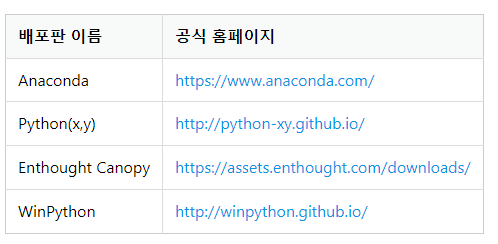

---
sidebar:
  nav: "docs"
title: 아나콘다
---

아나콘다는 파이썬 배포판입니다.   
`파이썬 인터프리터 + 파이썬 패키지` 라고 생각하면 됩니다.   

아나콘다는 `Numpy`, `Pandas`, `Jupyter Notebook` 등 이 책에서 사용할 대부분의 패키지를 전부 포함하고 있습니다.   

**<i class="fa fa-info-circle" aria-hidden="true"></i> Numpy(Numerical Python)**   
수치 연산을 위한 강력한 도구를 제공하는 패키지입니다.
NumPy는 선형 대수, 푸리에 변환, 난수 발생기, 통계 관련 함수 등 다양한 수학 함수와 도구를 제공합니다.     
과학적 연구, 데이터 분석, 기계 학습, 이미지 처리 등 다양한 분야에서 사용되고 있습니다.    
{: .notice--info}

**<i class="fa fa-info-circle" aria-hidden="true"></i> Pandas**   
파이썬 프로그래밍 언어를 이용하여 데이터 조작과 분석을 위한 오픈 소스 라이브러리    
NumPy를 기반으로 하면서 데이터를 보다 쉽고 효과적으로 다룰 수 있도록 도와줍니다.    
판다스는 주로 표 형태로 데이터를 다루는데, 이를 위해 DataFrame이라는 데이터 구조를 제공합니다.    
판다스는 데이터 시각화와 결합하여 데이터를 이해하고 표현하는데 유용합니다.    
{: .notice--info}

**<i class="fa fa-info-circle" aria-hidden="true"></i> Jupyter Notebook**   
오픈 소스 프로젝트로, 대화형 컴퓨팅과 데이터 시각화를 지원하는 웹 기반의 인터랙티브한 개발 환경입니다.    
파이썬을 비롯한 다양한 프로그래밍 언어를 지원하며, 데이터 분석, 기계 학습, 인공 지능 등 다양한 분야에서 사용됩니다.    
{: .notice--info}

**<i class="fa fa-info-circle" aria-hidden="true"></i> 대화형 컴퓨팅**   
대화형 컴퓨팅은 사람과 컴퓨터 사이에서 자연스러운 대화를 통해 상호작용하는 컴퓨팅 기술을 말합니다.   
이러한 기술은 인간의 언어를 이해하고 분석하여 그에 따른 적절한 응답을 생성하며, 보다 자연스러운 대화 경험을 제공하는 데 초점을 둡니다.   
{: .notice--info}

---

