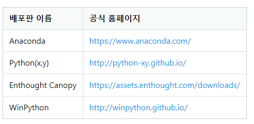

---
sidebar:
  nav: "docs"
title: 파이썬
---

---

파이썬은 인터프리터 언어로서, 컴파일 과정 없이 코드를 한 줄씩 실행하면서 결과를 바로 확인할 수 있습니다.   

파이썬은 다양한 플랫폼(운영체제)에서 동작하며, 다양한 용도로 사용됩니다.   
웹 개발, 데이터 분석, 인공지능과 머신 러닝, 자동화 스크립트 작성 등 다양한 분야에서 인기를 얻고 있습니다.   

파이썬은 객체 지향 프로그래밍, 함수형 프로그래밍 등 다양한 프로그래밍 패러다임을 지원하여 유연하게 코드를 작성할 수 있습니다.    

파이썬 설치 파일은 크게 두 가지로 구분됩니다.

 - 파이썬 공식 홈페이지에서 제공하는 설치 파일
 - 배포판이라고 불리는 설치 파일

첫 번째는 파이썬 공식 홈페이지(http://www.python.org)에서 제공하는 설치 파일로서 CPython이라고 합니다. 해당 파일을 내려받아 설치하면 파이썬 인터프리터와 몇 가지 프로그램이 설치됩니다.   

두 번째는 배포판이라고 불리는 설치 파일입니다.   
배포판은 ‘파이썬 인터프리터 + 파이썬 패키지’라고 생각하면 됩니다.   

---
